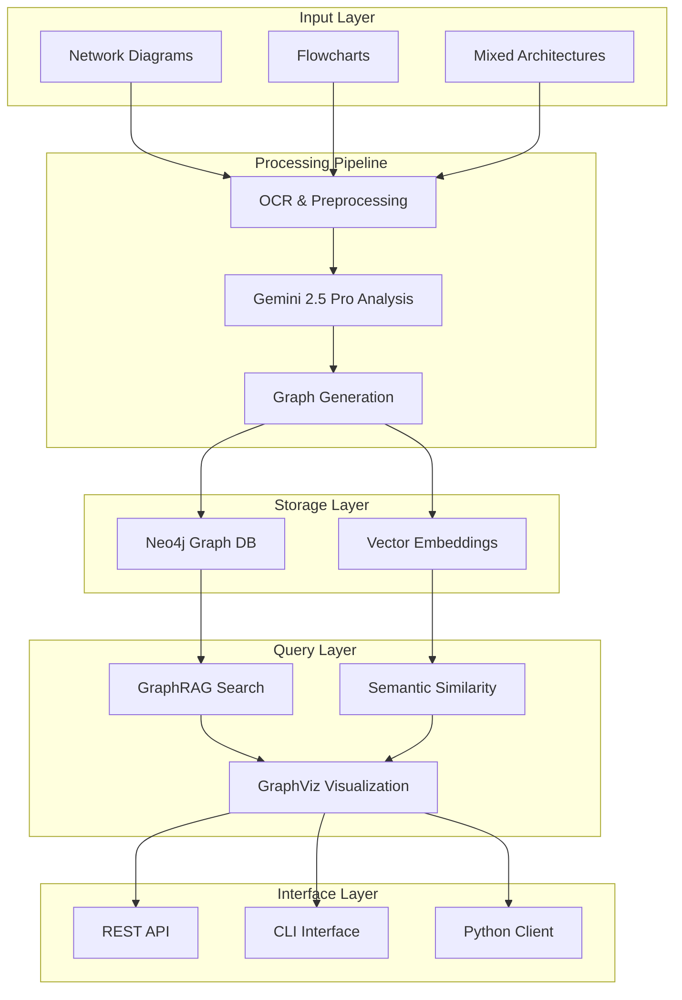

# NetBot v2 🤖

**AI-powered network diagram processing and GraphRAG system for transforming network diagrams into knowledge graphs**

NetBot v2 is a streamlined system that converts network diagrams and flowcharts into structured knowledge graphs, enabling powerful semantic search and analysis through Graph-based Retrieval Augmented Generation (GraphRAG) capabilities.

## 🚀 Features

- **3-Phase Processing Pipeline**: OCR → Relationship Generation → Export & Storage
- **Advanced GraphRAG**: Semantic search with embeddings and vector storage
- **Multiple Diagram Types**: Network diagrams, flowcharts, and mixed architectures
- **Knowledge Graph Generation**: Automatic Neo4j graph database population
- **Visual Analysis**: AI-powered relationship extraction using Gemini 2.5 Pro
- **Clean Architecture**: Simplified, maintainable codebase
- **GraphViz Visualization**: High-quality graph visualizations
- **API Server**: FastAPI-based REST API with role-based access

## 📋 Quick Start

### Installation

```bash
# Basic installation
pip install -r requirements.txt

# Or install as package
pip install -e .
```

### Environment Setup

Create a `.env` file:

```bash
# Required
GEMINI_API_KEY="your-gemini-api-key"
NEO4J_URI="bolt://localhost:7687"
NEO4J_USER="neo4j"
NEO4J_PASSWORD="your-password"

# Optional for OCR
GOOGLE_APPLICATION_CREDENTIALS="path/to/google-credentials.json"
```

### Quick Example

```bash
# Start API server
python api_server.py

# Or use CLI directly
python cli.py quickstart data/examples/network_diagram.png diagram_001 "find load balancers"
```

## 🏗️ Architecture

### Core Components

- **`diagram_processing/`** - 3-phase image-to-graph pipeline
- **`graph_rag/`** - Advanced retrieval system with embeddings
- **`embeddings/`** - Vector encoding and semantic search
- **`context_manager/`** - Session and conversation management
- **`api_server.py`** - FastAPI REST API interface

### System Architecture



## 🔧 Usage

### API Server

```bash
# Start the server
python api_server.py

# Access API docs
# http://localhost:8000/docs
```

**Public Endpoints:**
- `POST /chat` - Search existing diagrams
- `GET /diagrams` - List available diagrams

**Admin Endpoints:**
- `POST /admin/upload-diagram` - Process new diagrams
- `DELETE /admin/diagrams/{diagram_id}` - Delete diagrams

### Command Line Interface

```bash
# Complete workflow
python cli.py quickstart image.png diagram_001 "find load balancers"

# Process only
python -m diagram_processing process image.png diagram_001

# Search only
python -m graph_rag search "find servers" diagram_001

# Add embeddings
python -m embeddings add diagram_001
```

### Python API

```python
from client import NetBot

# Initialize client
netbot = NetBot()

# Complete workflow
results = netbot.quickstart(
    image_path="data/examples/network_diagram.png",
    query="find load balancers"
)

# Step-by-step
netbot.process_diagram("image.png", "diagram_001")
netbot.add_embeddings("diagram_001")
results = netbot.search("find servers", "diagram_001")
```

## 🎯 Key Components

### 1. Diagram Processing Pipeline

**3-Phase Process:**
1. **Phase 1**: OCR & Preprocessing (Google Cloud Vision + OpenCV)
2. **Phase 2**: Relationship Generation (Gemini 2.5 Pro)
3. **Phase 3**: Export & Storage (CSV + Neo4j)

### 2. GraphRAG System

**Features:**
- Two-phase retrieval (vector + graph search)
- Semantic embeddings with Sentence Transformers
- Query result caching
- AI-powered explanations

### 3. Visualization

**GraphViz Integration:**
- High-quality static visualizations
- Multiple layout algorithms (dot, neato, circo, etc.)
- Publication-ready output formats

### 4. API Server

**FastAPI Features:**
- Role-based access control
- JWT authentication for admin endpoints
- Comprehensive error handling
- CORS support

## 📊 Output Structure

```
data/processed/
├── [image_name]/
│   ├── nodes.csv               # Extracted nodes with properties
│   ├── relationships.csv       # Relationships between nodes
│   └── pipeline_metadata.json  # Processing metadata
```

## 🗂️ Repository Structure

```
netbot-v2/
├── api_server.py               # FastAPI REST API
├── cli.py                      # Main CLI interface
├── client.py                   # Python client
├── diagram_processing/         # Core processing pipeline
├── graph_rag/                  # GraphRAG system
├── embeddings/                 # Embedding management
├── context_manager/            # Session management
├── models/                     # Data models
├── data/                       # Examples & processed results
├── docs/                       # Documentation
└── requirements.txt            # Dependencies
```

## 🔧 Dependencies

### Core Requirements
- **Neo4j** (5.13.0+) - Graph database
- **Google Gemini API** (0.8.5+) - AI reasoning
- **Sentence Transformers** (3.0.0+) - Embeddings
- **GraphViz** - Visualization
- **FastAPI** - API server
- **OpenCV** - Image processing

### Optional
- **Google Cloud Vision** - Advanced OCR
- **ChromaDB** - Vector storage
- **APOC** - Neo4j procedures (for performance)

## 🚀 Performance Notes

- **Simplified Architecture**: Removed complex modular structure for better maintainability
- **No Timing Overhead**: Clean query execution without performance monitoring
- **GraphViz Only**: Removed NetworkX/Matplotlib dependencies
- **Direct Dependencies**: Eliminated unnecessary abstraction layers

## 📖 Documentation

- **Architecture Guides**: `docs/architecture/` - System design documents
- **Examples**: `data/examples/` - Sample network diagrams
- **API Docs**: Available at `/docs` when running the server

## 🤝 Contributing

1. Fork the repository
2. Create a feature branch (`git checkout -b feature/amazing-feature`)
3. Commit changes (`git commit -m 'Add amazing feature'`)
4. Push to branch (`git push origin feature/amazing-feature`)
5. Open a Pull Request

## 📄 License

MIT License - see LICENSE file for details.

## 🙏 Acknowledgments

- **Google Gemini 2.5 Pro** - Visual AI reasoning
- **Neo4j** - Graph database platform  
- **Sentence Transformers** - Semantic embeddings
- **GraphViz** - Graph visualization
- **FastAPI** - Modern web framework

---

**NetBot v2** - Clean, focused, and powerful diagram-to-knowledge-graph transformation 🚀