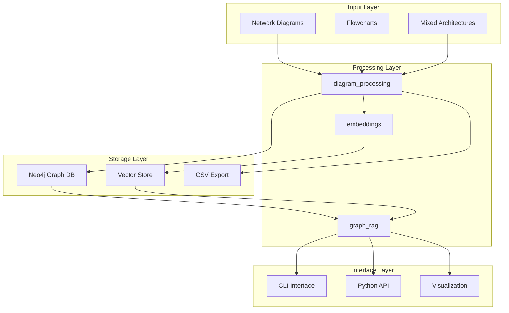
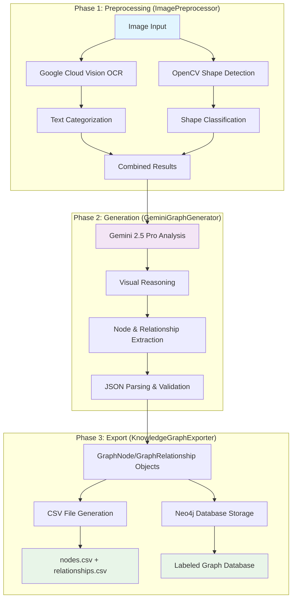
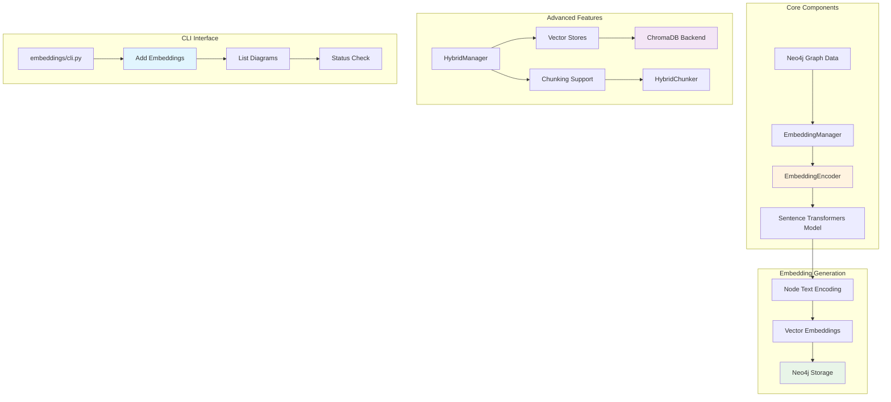

# NetBot v2 🤖

**AI-powered network diagram processing and GraphRAG system for transforming network diagrams into knowledge graphs**

NetBot v2 is a sophisticated system that converts network diagrams and flowcharts into structured knowledge graphs, enabling powerful semantic search and analysis through advanced Graph-based Retrieval Augmented Generation (GraphRAG) capabilities.

## 🚀 Features

- **3-Phase Processing Pipeline**: OCR → Relationship Generation → Export & Storage
- **Advanced GraphRAG**: Semantic search with embeddings and vector storage
- **Multiple Diagram Types**: Network diagrams, flowcharts, and mixed architectures
- **Knowledge Graph Generation**: Automatic Neo4j graph database population
- **Visual Analysis**: AI-powered relationship extraction using Gemini 2.5 Pro
- **Modular Architecture**: Pluggable components with unified CLI interfaces
- **Context Management**: Session handling and conversation history
- **Rich Visualization**: Multiple graph visualization backends

## 📋 Quick Start

### Installation

```bash
# Basic installation
pip install -e .

# With optional features
pip install -e ".[vision,storage,nlp,vector]"

# Development setup
pip install -e ".[dev]"

# Install everything
pip install -e ".[all]"
```

### Environment Setup

Create a `.env` file:

```bash
# Required
GEMINI_API_KEY="your-gemini-api-key"
NEO4J_URI="bolt://localhost:7687"
NEO4J_USER="neo4j"
NEO4J_PASSWORD="your-password"

# Optional
GOOGLE_APPLICATION_CREDENTIALS="path/to/google-credentials.json"
```

### Quick Example

```bash
# Complete workflow (recommended)
python cli.py quickstart data/examples/network_diagram.png diagram_001 "find load balancers"

# Step-by-step workflow
python cli.py process-and-search data/examples/network_diagram.png diagram_001 "find servers" --visualize --explain
```

## 🏗️ Architecture

### Core Components

- **`diagram_processing/`** - 3-phase image-to-graph pipeline
- **`graph_rag/`** - Advanced retrieval system with embeddings
- **`embeddings/`** - Vector encoding and semantic search
- **`context_manager/`** - Session and conversation management
- **`interfaces/`** - Unified CLI system

### System Architecture Overview



## 🔄 Core System Components

### 1. Diagram Processing Pipeline

The `diagram_processing` module transforms images into structured knowledge graphs through a 3-phase pipeline:



**Key Features:**
- **NetworkGraphOCR**: Google Cloud Vision with text categorization
- **ShapeDetector**: OpenCV-based geometric shape detection
- **GeminiGraphGenerator**: Gemini 2.5 Pro visual analysis
- **JSON Utilities**: Robust parsing with fallback strategies
- **KnowledgeGraphPipeline**: Complete orchestration class

### 2. Embeddings System

The `embeddings` module provides semantic understanding and vector search capabilities:



**Key Features:**
- **EmbeddingManager**: Direct Neo4j embedding integration
- **EmbeddingEncoder**: Sentence Transformers wrapper
- **Advanced Vector Stores**: ChromaDB with base store abstraction
- **Document Chunking**: HybridChunker for large content
- **CLI Tools**: Command-line embedding management

### 3. GraphRAG System

The `graph_rag` module provides intelligent retrieval and reasoning over knowledge graphs:

```mermaid
graph TB
    subgraph "Database Layer"
        A3[Neo4jConnection] --> B3[DataAccess]
        B3 --> C3[QueryExecutor]
        C3 --> D3[SchemaExtractor]
    end
    
    subgraph "Retrieval Engine"
        E3[TwoPhaseRetriever] --> F3[CypherGenerator]
        F3 --> G3[Neo4j Queries]
        E3 --> H3[Vector Search]
        H3 --> I3[Embedding Cache]
    end
    
    subgraph "Search Components"
        J3[VectorSearch] --> K3[Similarity Matching]
        J3 --> L3[EmbeddingCache]
        L3 --> M3[Result Caching]
    end
    
    subgraph "Visualization"
        N3[VisualizationFactory] --> O3[NetworkXVisualizer]
        N3 --> P3[GraphvizVisualizer]
        O3 --> Q3[Static Layouts]
        P3 --> R3[Publication Quality]
    end
    
    subgraph "Client Interface"
        S3[GraphRAG Client] --> T3[Search & Visualize]
        T3 --> U3[Gemini Integration]
        U3 --> V3[Explanation Generation]
    end
    
    style F3 fill:#e3f2fd
    style H3 fill:#fff3e0
    style L3 fill:#f3e5f5
    style T3 fill:#e8f5e8
```



**Key Features:**
- **Neo4j Integration**: Complete database abstraction layer
- **Two-Phase Retrieval**: Structural + semantic search combination
- **Cypher Generation**: Dynamic query construction
- **Vector Search**: Embedding-based similarity matching
- **Visualization Factory**: NetworkX and Graphviz backends
- **Gemini Integration**: AI-powered explanations and responses

## 🔧 Usage

### Command Line Interface

#### Main CLI (Orchestration)
```bash
# Complete automated workflow
python cli.py quickstart image.png diagram_id "query"

# Advanced processing with visualization
python cli.py process-and-search image.png diagram_id "query" --visualize --explain
```

#### Specialized Module CLIs
```bash
# Diagram processing
python -m diagram_processing process image.png diagram_id

# GraphRAG operations
python -m graph_rag search "find load balancers" diagram_id
python -m graph_rag visualize "show topology" diagram_id --backend graphviz

# Embeddings management
python -m embeddings add diagram_id
```

### Python API

#### Quick Processing
```python
from diagram_processing import process_diagram

# Process single diagram
result = process_diagram("image.png", "diagram_001")
print(f"Found {len(result.nodes)} nodes and {len(result.relationships)} relationships")
```

#### Full GraphRAG System
```python
from graph_rag import GraphRAG

# Initialize system
rag = GraphRAG()

# Process and add embeddings
result = rag.process_diagram("image.png", "diagram_001")
rag.add_embeddings("diagram_001")

# Semantic search
results = rag.search(
    query="Find all load balancers and their connections",
    diagram_id="diagram_001"
)

# Visualize results
rag.visualize(results, "results.html")
rag.close()
```

## 📊 Output Structure

```
data/processed/
├── [image_name]/
│   ├── nodes.csv               # Extracted nodes with properties
│   ├── relationships.csv       # Relationships between nodes
│   └── pipeline_metadata.json  # Processing metadata
```

## 🎯 Key Features

### Diagram Processing
- **OCR Integration**: Google Cloud Vision API for text extraction
- **Shape Detection**: OpenCV-based geometric analysis
- **AI Relationship Extraction**: Gemini 2.5 Pro visual reasoning
- **Multi-format Export**: CSV, JSON, Neo4j direct storage

### GraphRAG System
- **Two-Phase Retrieval**: Structural + semantic search
- **Vector Embeddings**: Sentence Transformers integration
- **Caching**: Intelligent embedding and query caching
- **Visualization**: NetworkX, Graphviz backends

### Context Management
- **Session Handling**: Stateful conversation management
- **Storage Backends**: In-memory, Redis, MongoDB, PostgreSQL
- **Query Rewriting**: Intelligent context-aware query enhancement
- **Analytics**: Usage tracking and performance monitoring

## 🗂️ Repository Structure

```
netbot-v2/
├── cli.py                      # Main orchestration CLI
├── diagram_processing/         # Core processing pipeline
│   ├── pipeline/               # 3-phase processing
│   ├── models/                 # Data models
│   └── utils/                  # OCR, shape detection, JSON parsing
├── graph_rag/                  # GraphRAG system
│   ├── retrieval/              # Two-phase retrieval
│   ├── search/                 # Vector search & caching
│   └── visualization/          # Graph visualization
├── embeddings/                 # Embedding management
│   ├── advanced/               # Hybrid RAG features
│   └── vector_stores/          # Vector database support
├── context_manager/            # Session management
│   ├── core/                   # Processing components
│   ├── storage/                # Storage backends
│   └── utils/                  # Analytics & maintenance
└── docs/                       # Architecture & guides
```

## 🔧 Dependencies

### Core Requirements
- **Neo4j** - Graph database storage
- **Google Gemini API** - Visual reasoning and relationship extraction
- **Sentence Transformers** - Semantic embeddings
- **OpenCV** - Image processing and shape detection
- **Pillow** - Image manipulation

### Optional Features
- **Google Cloud Vision** - Advanced OCR capabilities
- **ChromaDB** - Vector storage for semantic search
- **Redis/MongoDB/PostgreSQL** - External storage backends
- **Graphviz** - Advanced graph visualization

## 📖 Documentation

- **Architecture Guides**: `docs/architecture/` - Detailed system design
- **Examples**: `docs/examples/` - Usage examples and patterns
- **API Reference**: Module docstrings and type hints

## 🤝 Contributing

1. Fork the repository
2. Create a feature branch
3. Install development dependencies: `pip install -e ".[dev]"`
4. Run tests: `pytest`
5. Format code: `black . && isort .`
6. Submit a pull request

## 📄 License

MIT License - see LICENSE file for details.

## 🙏 Acknowledgments

- Built with Google Gemini 2.5 Pro for visual AI reasoning
- Powered by Neo4j for graph storage and querying
- Uses Sentence Transformers for semantic embeddings
- Visualization powered by NetworkX and Graphviz

---

**NetBot v2** - Transforming visual diagrams into intelligent knowledge graphs 🚀