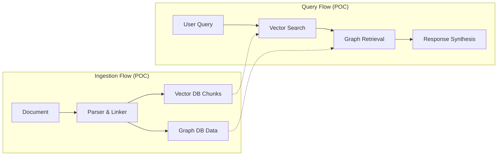
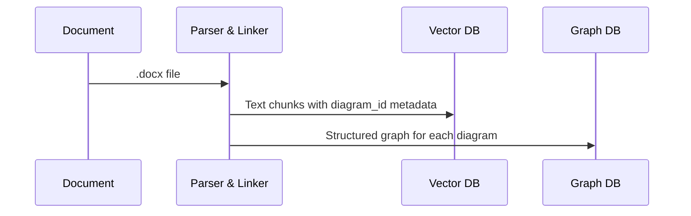
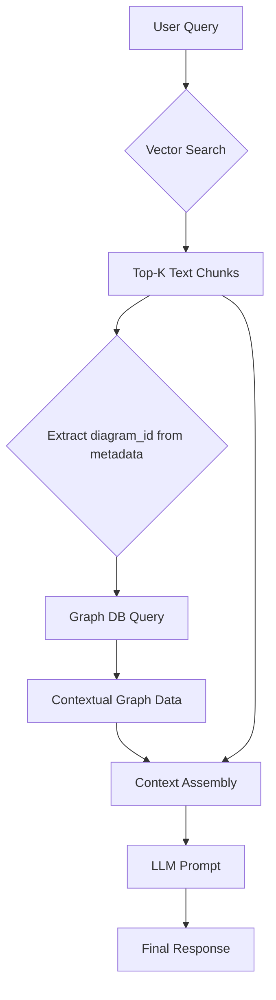

# Hybrid RAG POC Architecture: Linking Text and Diagrams

## POC Goal

The objective of this Proof of Concept is to validate a single, core hypothesis: **explicitly linking text chunks to their associated diagrams via metadata will produce significantly more accurate and contextually aware responses from a RAG system** compared to a text-only approach.

This POC will focus on implementing the essential "golden path" for ingestion and querying to prove this foundational concept.

-----

## Core Architectural Principles

The POC will adhere to two primary design principles:

1.  **Primacy of Textual Context**: Vector search on document text will initiate the retrieval process.
2.  **Explicit Context Linking**: A metadata bridge (`associated_diagram_id`) will connect relevant text chunks to structured graph data derived from diagrams.

-----

## POC Core Workflow

The system operates through a simplified ingestion and query flow designed to test the main hypothesis.



-----

## Ingestion Pipeline for POC

The ingestion pipeline will extract text and diagrams, creating the crucial metadata link.

### Data Flow



### Parser & Linker (The Core Task)

The main challenge for the POC is the **Parser & Linker**. It will:

1.  Parse the document, identifying text and images.
2.  When a diagram is found, assign it a unique `diagram_id`.
3.  Process the diagram through the `diagram-to-graph` pipeline and store the result in the Graph DB, with every node and relationship tagged with the `diagram_id`.
4.  For the text immediately **above and below** the diagram (e.g., within a 2-paragraph window), create standard text chunks.
5.  **Crucially, add the `diagram_id` to the metadata of each of these surrounding text chunks** before embedding and storing them in the Vector DB.

### Vector Database Schema (POC)

```json
{
  "vector": [0.1, 0.2, ...],
  "metadata": {
    "text": "The following flowchart shows the approval steps...",
    "source_document": "approvals.docx",
    "associated_diagram_id": "diagram_approvals_1"
  }
}
```

### Graph Database Pattern (POC)

```cypher
// Diagram-partitioned graph storage
(p:Process {
  name: 'Submit Request',
  diagram_id: 'diagram_approvals_1'
})
-[:FLOWS_TO {diagram_id: 'diagram_approvals_1'}]->
(d:Decision {
  name: 'Manager Approval?',
  diagram_id: 'diagram_approvals_1'
})
```

-----

## Query Pipeline for POC

The query process will execute the two-phase retrieval strategy.

### Two-Phase Retrieval



### Context Assembly (POC)

For the POC, context assembly is straightforward. We will create a simple prompt for the LLM that includes the retrieved information.

```python
# Conceptual implementation
class SimpleContextAssembler:
    def assemble_prompt(self, query, text_chunks, graph_data):
        prompt = f"""
        User Query: {query}

        Use the following retrieved context to answer the query.
        The text and the graph data are related.

        Retrieved Text:
        ---
        {' '.join([chunk.text for chunk in text_chunks])}
        ---

        Retrieved Graph Data (Nodes and Relationships):
        ---
        {self.format_graph_for_llm(graph_data)}
        ---

        Answer the user's query based ONLY on the provided context.
        """
        return prompt
```

-----

## POC Success Criteria & Next Steps

### Success Criteria

The POC will be considered successful if:

1.  The ingestion pipeline can successfully link text chunks to corresponding diagrams with a `diagram_id`.
2.  The two-phase retrieval successfully fetches both text and graph context for relevant queries.
3.  Qualitative analysis shows that the combined context leads to answers that are demonstrably more complete and accurate than a text-only RAG for queries that require diagrammatic understanding.

### Future Considerations (Post-POC)

If successful, future work will focus on production-level features that were intentionally left out of this POC, such as:

  * **Advanced Reliability**: Implementing a full hallucination and reliability framework.
  * **Scalability**: Deploying services in a scalable, containerized environment.
  * **Error Handling**: Building graceful degradation for when graph retrieval or other components fail.

-----

## Conclusion

This document outlines a lean, focused POC to test the core value proposition of a hybrid RAG architecture. By concentrating on the essential task of linking text to diagram context, we can efficiently validate the approach and make an informed decision on further investment.