AI Architecture

[[RAG]]
[[Projects/RAG/GraphRAG/GraphRAG|GraphRAG]]
[[Hybrid RAG Architecture]]
[[diagram-to-graph Architecture]]

> [!summary] Executive Summary

> This architecture outlines a sophisticated Hybrid Retrieval-Augmented Generation (RAG) system designed to power a chatbot from a corpus of Microsoft Word documents. The core innovation lies in its **context-aware retrieval mechanism**: the system first identifies relevant text passages using a vector database and then uses metadata links to retrieve associated flowchart data from a graph database. This approach directly leverages the existing `diagram-to-graph` pipeline for all visual processing.

## Core Architectural Principles

1. **Primacy of Textual Context**: Retrieval is initiated by finding relevant text. Diagrams are treated as supplementary, contextual information linked to that text.
2. **Explicit Context Linking**: A robust metadata link between text chunks and diagram graphs is the cornerstone. We must know precisely which diagram belongs to which text.
3. **Leverage, Don't Rebuild**: The existing `diagram-to-graph` project is a production-ready component. We will treat it as a specialized microservice for visual processing.
4. **Separation of Concerns**: The final response generation is a two-part process: LLM-based text synthesis and deterministic Mermaid diagram generation.

---
## System Architecture: Two Core Flows

The system is best understood as two distinct flows:

**[[#1. Ingestion Flow: Building the Knowledge Base]]**: A one-time process to build the knowledge base.
**[[#2. Query Flow: Answering User Questions]]**: A real-time flow to answer user questions.

## 1. Ingestion Flow: Building the Knowledge Base

This flow processes the corpus of Word documents and populates the Vector and Graph databases.

```mermaid

graph TD
subgraph "📚 Document Corpus"
DOC["Word Documents (.docx)"]
end

subgraph "⚙️ Ingestion Pipeline"
A["Word Document Parser"]
B["Content Extractor & Linker"]
C["Text Chunking & Embedding"]
D["Image Processor (Your diagram-to-graph Pipeline)"]
end

subgraph "💾 Knowledge Stores"
VDB["(Vector Database<br/>Stores Text Chunks with Diagram Links)"]
GDB["(Neo4j Graph Database<br/>Stores Flowchart Graphs)"]
end

DOC --> A
A --> B
B -- Text Paragraphs --> C
B -- "Images with Unique IDs" --> D
C -- "Chunks with `associated_diagram_id`" --> VDB
D -- "Structured Graph Data + ID" --> GDB

```



### Component Breakdown (Ingestion)

> [!info]

> The most critical new component in this flow is the **Content Extractor & Linker**, which creates the metadata bridge between text and diagrams.

1. **Word Document Parser**:
	* **Technology**: `python-docx` library.
	* **Function**: Iterates through a `.docx` file, identifying paragraphs of text and embedded images in their original sequence.

2. **Content Extractor & Linker**:
	* **Function**: Orchestrates the association between text and diagrams.
	* **Logic**:
		1. Iterate through the parsed document content.
		2. When an image is found, generate a `unique_diagram_id`.
		3. **Context Capture**: Extract text paragraphs immediately *before* and *after* the image.
		4. **Metadata Assignment**: Tag these captured paragraphs with the `unique_diagram_id`.
		5. Pass the image data and its ID to the [[#Image Processor]].
		6. Pass all text paragraphs to the [[#Text Chunking & Embedding]].

3. **Text Chunking & Embedding**:
	* **Technology**: LangChain/LlamaIndex for chunking, Google `text-embedding-004` for embeddings.
	* **Function**: Chunks text paragraphs while preserving the `associated_diagram_id` in the metadata of each relevant chunk.
	* **Vector DB Record Structure**:
```json
{
	"vector": [0.1, 0.2, ...],
	"metadata": {
	"text": "The following flowchart shows the approval steps...",
	"source_document": "approvals.docx",
	"chunk_id": "chunk_123",
	"associated_diagram_id": "diagram_approvals_1"
	}
}
```

4. **Image Processor**:
	* **Technology**: Your existing `diagram-to-graph` repository, wrapped as a function or service.
	* **Function**:
		1. Receives an image and its `unique_diagram_id`.
		2. Executes your proven pipeline: `ImagePreprocessor` -> `GeminiRelationshipGenerator` -> `KnowledgeGraphExporter`.
		3. The `KnowledgeGraphExporter` is slightly modified to tag every node and relationship with the `unique_diagram_id`.
	* **Neo4j Data Structure**:
```cypher
// All nodes and relationships for a diagram share a common ID property
(p:Process {name: 'Submit Request', diagram_id: 'diagram_approvals_1'})
(d:Decision {name: 'Manager Approval?', diagram_id: 'diagram_approvals_1'})
(p)-[:FLOWS_TO {diagram_id: 'diagram_approvals_1'}]->(d)
```


## 2. Query Flow: Answering User Questions

This is the real-time flow that occurs when a user interacts with the chatbot.


### Component Breakdown (Query)

1. **Vector Search**:
	- The user's query is converted into an embedding and searched against the Vector Database.
	* The top K most relevant text chunks are retrieved, complete with their metadata.

2. **Contextual Graph Lookup**:
	* **Function**: Inspects the metadata of the retrieved text chunks to find `associated_diagram_id` values.
	* It then queries the Neo4j database to retrieve the corresponding flowchart data.
	* **Query Example**:
```cypher
MATCH (n {diagram_id: $diagram_id})
OPTIONAL MATCH (n)-[r {diagram_id: $diagram_id}]->(m)
RETURN n, r, m
```

3. **Context Assembly**:
	* Gathers all retrieved text and graph information into a structured context object for the LLM.
	* **Context Object Example**:
```json
{
	"user_query": "What happens if a manager rejects the request?",
	"retrieved_text": [
	"If the manager rejects the request, the process loops back to the 'Revise Request' step as shown in the flowchart."
	],
	"retrieved_graph": {
		"nodes": [
			{"id": "d1", "label": "Manager Approval?", "type": "decision"},
			{"id": "p2", "label": "Revise Request", "type": "process"}
		],
		"relationships": [
			{"source_id": "d1", "target_id": "p2", "label": "FLOWS_TO", "properties": {"condition": "No"}}
		]
	}
}
```

4. **Response Synthesis (LLM)**:
	* **Technology**: Gemini 2.5 Pro.
	* **Function**: The assembled context and user query are fed into a prompt. The LLM's job is to synthesize a natural language answer based on *all* provided information.
	* **Prompt Snippet**:
```
You are a helpful assistant. Answer the user's question using the provided text and flowchart data.

User Question: {user_query}
Relevant Text: {retrieved_text}
Relevant Flowchart Data: {retrieved_graph_json}

Synthesize a clear, step-by-step answer.
```

5. **Mermaid Generation**:

> [!note] This is a deterministic, non-AI component.

* If the context object contains graph data, this component takes the structured list of nodes and relationships and formats it into a Mermaid markdown string. This happens in parallel to the LLM synthesis to ensure a syntactically perfect diagram is always generated.

---
## Graph Database Best Practices

> [!tip] Best Practice: Multi-Graph Storage in a Single Database

> For this use case, the best practice is to store all diagrams as logically separate subgraphs within a **single Neo4j database**. This avoids the operational overhead and query complexity of managing multiple databases, a feature typically reserved for Neo4j Enterprise Edition for multi-tenancy.

### The `diagram_id` Partitioning Pattern

The key to managing multiple graphs is adding a `diagram_id` property to every node and relationship that belongs to a specific diagram. This partitions the data logically.


### Why this pattern is superior:

- **Performance**: With an index on the `diagram_id` property, looking up a specific diagram's data is instantaneous, regardless of how many other diagrams are in the database.
```cypher
CREATE INDEX diagram_id_index FOR (n) ON (n.diagram_id);
```

- **Contextual Integrity**: Ensures that queries for one diagram do not accidentally include nodes or relationships from another.

- **Enables Meta-Analysis**: Because all graphs are in the same database, you can create relationships *between* graphs in the future, for example, to show that one process flow relies on another.

### The Query Workflow

The `diagram_id` is the pivot from the text world to the graph world.

1. **Vector Search**: Find relevant text chunks.
2. **Extract Link**: Get the `associated_diagram_id` from the text chunk's metadata.
3. **Scoped Graph Query**: Use the ID to query Neo4j for that specific subgraph.
```cypher
// Efficiently retrieve all parts of a single diagram
MATCH (n {diagram_id: $diagram_id})
OPTIONAL MATCH (n)-[r {diagram_id: $diagram_id}]->(m)
RETURN n, r, m
```

This approach is scalable, performant, and maintains the contextual link between your text and your diagrams perfectly.

---
## Conclusion

> [!success]

> This architecture provides a robust and practical solution by creating a clear, two-stage retrieval process that honors the relationship between text and diagrams in your source documents. By integrating your existing `diagram-to-graph` pipeline, we minimize new development and build upon a proven foundation. The result is a chatbot that doesn't just find information—it understands and presents it in the most effective format, combining textual explanation with clear visual workflows.