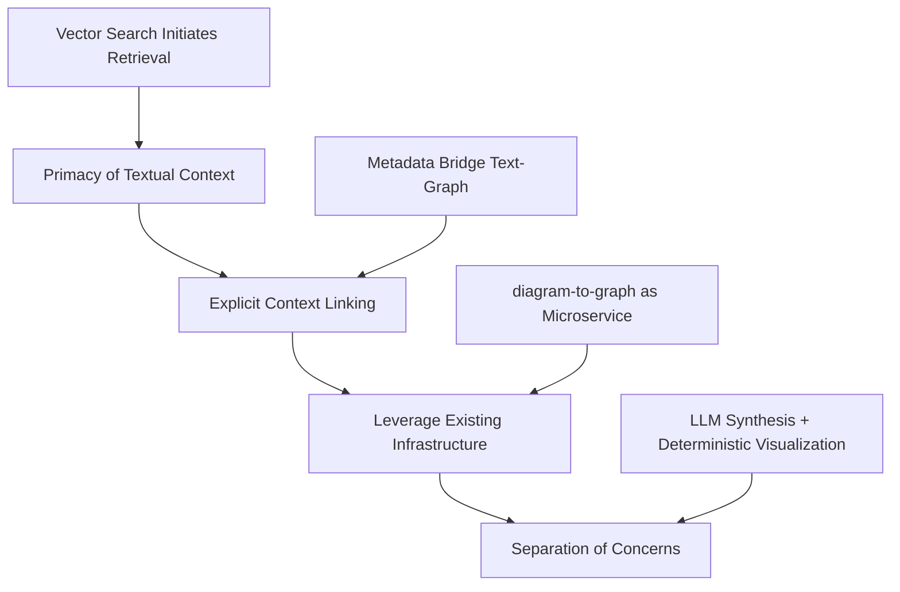
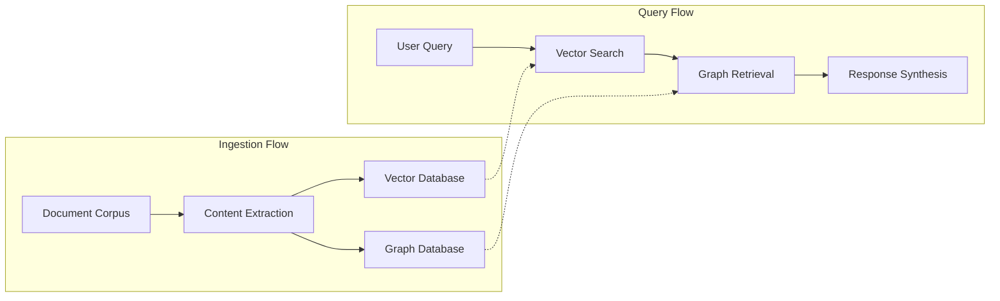
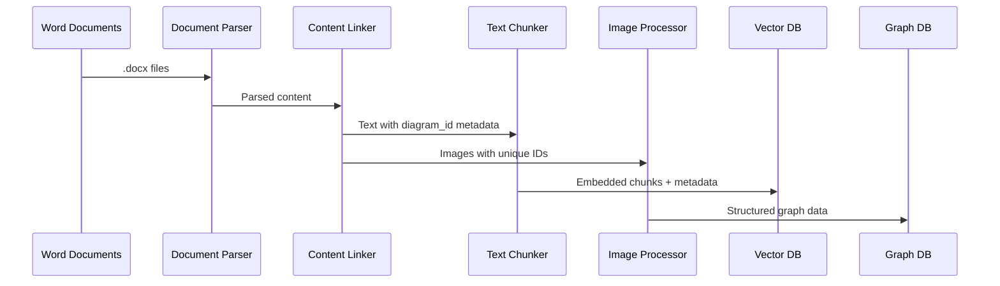
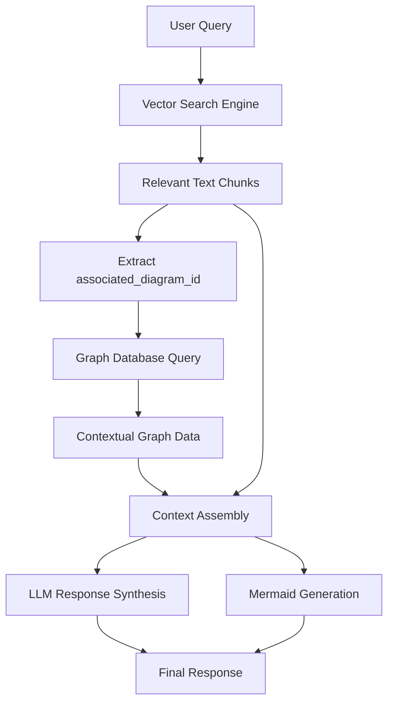
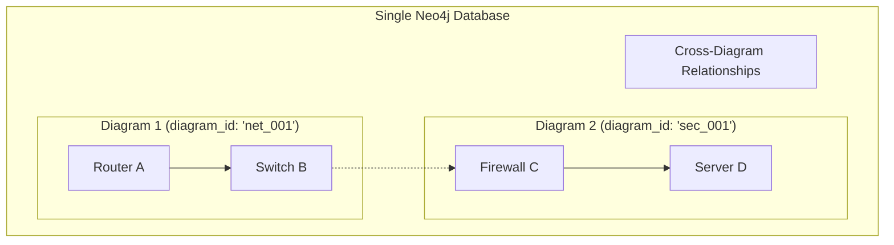
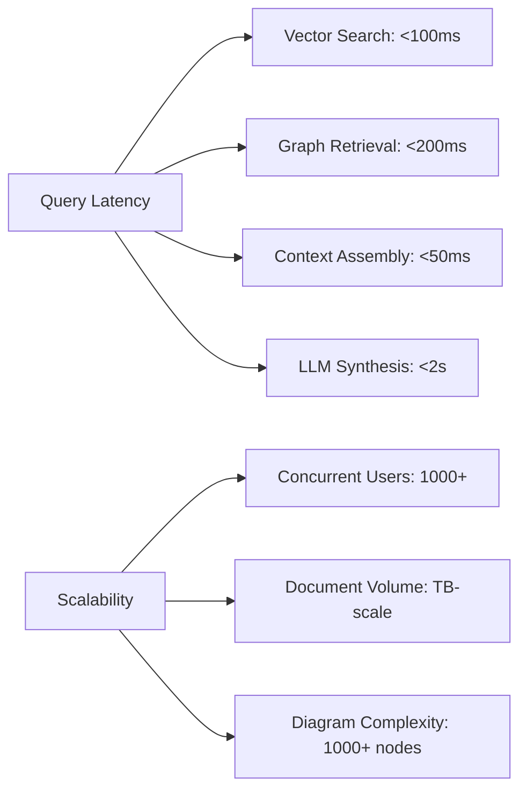
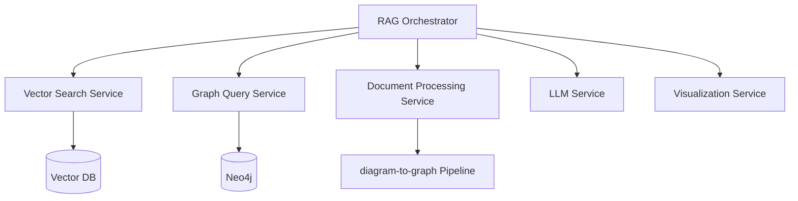
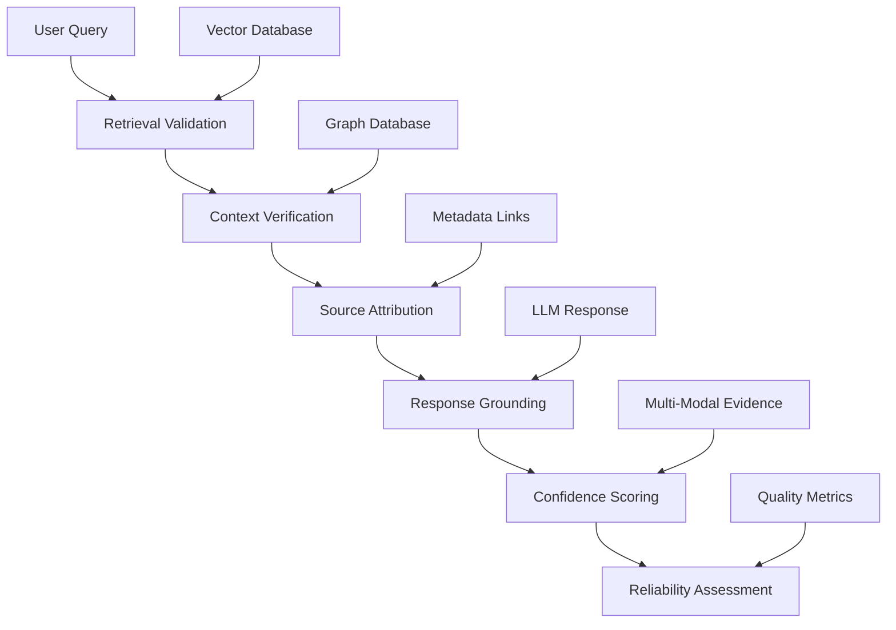
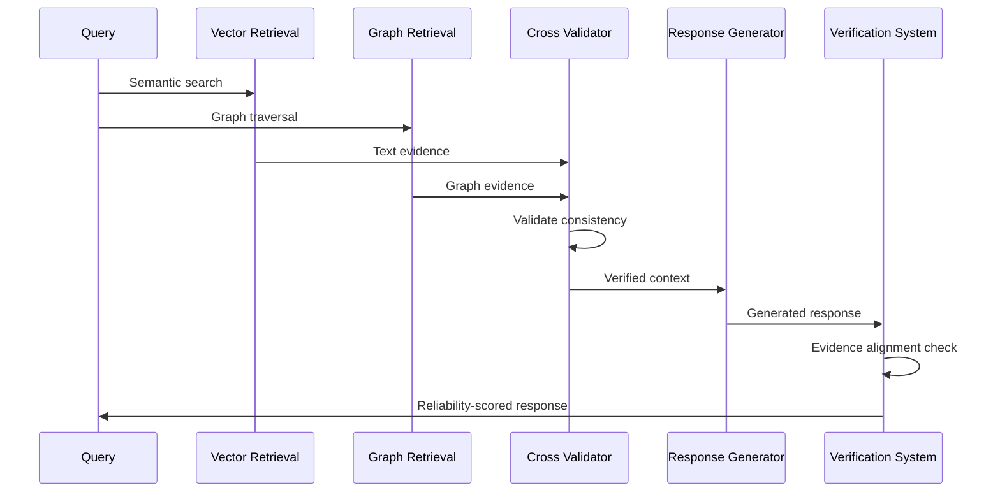
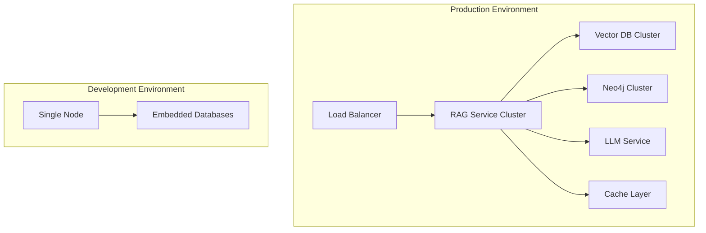

# Hybrid RAG Architecture: Advanced Document Intelligence System

## Executive Summary

This document outlines the architectural design of a sophisticated Hybrid Retrieval-Augmented Generation (RAG) system that combines semantic vector search with graph-based knowledge retrieval. The architecture addresses the critical challenge of extracting actionable intelligence from complex document repositories containing both textual content and embedded technical diagrams.

## Architectural Imperatives

### The Context-Aware Retrieval Challenge

Traditional RAG systems treat documents as isolated text chunks, missing critical relationships between textual descriptions and associated visual diagrams. Our hybrid architecture solves this through **context-aware metadata linking**, establishing explicit connections between text passages and diagram-derived graph data.

### Core Design Principles



1. **Primacy of Textual Context**: Vector search identifies relevant text; diagrams provide supplementary context
2. **Explicit Context Linking**: Robust metadata association between text chunks and diagram graphs
3. **Infrastructure Reuse**: Leverage existing `diagram-to-graph` pipeline as specialized microservice
4. **Architectural Separation**: Independent text synthesis and diagram generation components

## System Architecture Overview

The system operates through two distinct operational flows:



## Ingestion Pipeline Architecture

### Data Flow and Processing Stages



### Content Extractor & Linker Design

The critical innovation lies in the **Content Extractor & Linker** component, which creates the metadata bridge:

```python
# Conceptual implementation
class ContentLinker:
    def extract_and_link(self, document):
        for element in document.elements:
            if element.type == "image":
                diagram_id = generate_unique_id()
                context_paragraphs = self.capture_context(element)
                
                # Tag context with diagram association
                for paragraph in context_paragraphs:
                    paragraph.metadata["associated_diagram_id"] = diagram_id
                
                # Process image through diagram-to-graph pipeline
                self.process_image(element.data, diagram_id)
```

### Vector Database Schema

```json
{
  "vector": [0.1, 0.2, ...],
  "metadata": {
    "text": "The following flowchart shows the approval steps...",
    "source_document": "approvals.docx",
    "chunk_id": "chunk_123",
    "associated_diagram_id": "diagram_approvals_1"
  }
}
```

### Graph Database Pattern

```cypher
// Diagram-partitioned graph storage
(p:Process {
  name: 'Submit Request', 
  diagram_id: 'diagram_approvals_1',
  type: 'process'
})
(d:Decision {
  name: 'Manager Approval?', 
  diagram_id: 'diagram_approvals_1',
  type: 'decision'
})
(p)-[:FLOWS_TO {diagram_id: 'diagram_approvals_1', condition: 'default'}]->(d)
```

## Query Processing Architecture

### Two-Phase Retrieval Strategy



### Context Assembly Pattern

```python
class ContextAssembler:
    def assemble_context(self, text_chunks, graph_data):
        return {
            "user_query": self.original_query,
            "retrieved_text": [chunk.content for chunk in text_chunks],
            "retrieved_graph": {
                "nodes": graph_data.nodes,
                "relationships": graph_data.relationships
            },
            "metadata": {
                "confidence_scores": self.calculate_confidence(text_chunks),
                "diagram_sources": self.extract_diagram_sources(text_chunks)
            }
        }
```

## Graph Database Design Excellence

### Multi-Graph Storage Strategy



### Partitioning Benefits

**Performance Optimization**:
```cypher
// Indexed diagram_id enables O(1) lookup
CREATE INDEX diagram_id_index FOR (n) ON (n.diagram_id);

// Scoped queries prevent cross-contamination
MATCH (n {diagram_id: $diagram_id})
OPTIONAL MATCH (n)-[r {diagram_id: $diagram_id}]->(m)
RETURN n, r, m
```

**Scalability Advantages**:
- **Horizontal Scaling**: Add diagrams without performance degradation
- **Contextual Integrity**: Queries remain scoped to relevant subgraphs
- **Future Extensibility**: Enable cross-diagram relationship analysis

## Technical Benefits and Innovations

### Advanced Retrieval Capabilities

**Semantic-Graph Fusion**:
- Vector search identifies semantically relevant content
- Graph traversal provides complete contextual understanding
- Metadata linking ensures coherent text-visual relationships

**Multi-Modal Intelligence**:
- Text understanding through advanced embeddings
- Visual comprehension via diagram-to-graph pipeline
- Integrated reasoning across both modalities

### Performance Characteristics



### Error Resilience and Fault Tolerance

**Graceful Degradation**:
- Vector search continues if graph data unavailable
- Text-only responses when diagram processing fails
- Cached results provide backup for service outages

**Data Consistency**:
- Transactional updates ensure metadata integrity
- Versioning support for document updates
- Automated synchronization between storage layers

## Integration Patterns

### Microservice Architecture



### API Design Pattern

```python
class HybridRAGService:
    async def query(self, query: str, filters: Dict) -> RAGResponse:
        # Phase 1: Vector retrieval
        text_results = await self.vector_service.search(query, filters)
        
        # Phase 2: Graph expansion
        diagram_ids = self.extract_diagram_ids(text_results)
        graph_data = await self.graph_service.retrieve(diagram_ids)
        
        # Phase 3: Response synthesis
        context = self.assemble_context(text_results, graph_data)
        response = await self.llm_service.synthesize(context)
        
        return RAGResponse(
            text=response.text,
            diagrams=self.generate_visualizations(graph_data),
            sources=self.compile_sources(text_results, graph_data)
        )
```

## Hallucination Reduction and Reliability Architecture

### The Hallucination Challenge in RAG Systems

Traditional RAG systems suffer from **information fabrication** where LLMs generate plausible but factually incorrect responses, especially when dealing with incomplete or ambiguous contexts. Our hybrid architecture implements multiple layers of hallucination prevention and reliability assurance.

### Multi-Layer Reliability Framework



### Grounded Retrieval Mechanisms

**Explicit Source Attribution**:
```python
class GroundedRetrieval:
    def retrieve_with_provenance(self, query: str, diagram_id: str) -> GroundedContext:
        # Phase 1: Vector search with source tracking
        text_chunks = self.vector_search.search_with_metadata(query, diagram_id)
        
        # Phase 2: Graph retrieval with relationship validation
        graph_data = self.graph_search.retrieve_connected_subgraph(
            seed_nodes=self.extract_entities(text_chunks),
            diagram_id=diagram_id
        )
        
        # Phase 3: Cross-validation between text and graph
        validated_context = self.cross_validate_sources(text_chunks, graph_data)
        
        return GroundedContext(
            text_evidence=validated_context.text,
            graph_evidence=validated_context.graph,
            source_documents=self.extract_source_provenance(text_chunks),
            confidence_score=self.calculate_evidence_confidence(validated_context),
            validation_status=validated_context.validation_result
        )
```

**Context Verification Through Dual Modalities**:
- **Text-Graph Consistency**: Verify that textual descriptions align with graph relationships
- **Spatial Relationship Validation**: Ensure visual diagram relationships match textual descriptions
- **Cross-Reference Verification**: Validate information across multiple document sources

### Evidence-Based Response Generation

**Constrained Generation Framework**:
```python
class ConstrainedResponseGenerator:
    def generate_grounded_response(
        self, 
        context: GroundedContext, 
        query: str
    ) -> ReliableResponse:
        
        # Build evidence-constrained prompt
        constrained_prompt = self.build_evidence_prompt(
            query=query,
            text_evidence=context.text_evidence,
            graph_evidence=context.graph_evidence,
            source_attribution=context.source_documents
        )
        
        # Generate with explicit grounding instructions
        response = self.llm_client.generate(
            prompt=constrained_prompt,
            constraints={
                "must_cite_sources": True,
                "no_extrapolation": True,
                "evidence_only": True,
                "confidence_indicators": True
            }
        )
        
        # Post-generation validation
        reliability_score = self.validate_response_grounding(
            response, context.text_evidence, context.graph_evidence
        )
        
        return ReliableResponse(
            content=response.text,
            source_citations=self.extract_citations(response),
            confidence_score=reliability_score,
            evidence_coverage=self.calculate_evidence_coverage(response, context),
            potential_gaps=self.identify_knowledge_gaps(query, context)
        )
```

### Multi-Modal Evidence Fusion

**Cross-Validation Architecture**:


### Confidence and Uncertainty Quantification

**Multi-Dimensional Confidence Scoring**:
```python
class ConfidenceCalculator:
    def calculate_response_confidence(
        self, 
        response: str, 
        context: GroundedContext
    ) -> ConfidenceMetrics:
        
        scores = {
            # Source reliability
            "source_coverage": self.calculate_source_coverage(response, context),
            
            # Evidence alignment
            "text_graph_alignment": self.measure_modality_consistency(context),
            
            # Information completeness
            "context_completeness": self.assess_information_gaps(context),
            
            # Response grounding
            "response_grounding": self.validate_response_evidence(response, context),
            
            # Semantic coherence
            "semantic_consistency": self.check_semantic_coherence(response)
        }
        
        # Weighted composite confidence
        composite_confidence = self.calculate_weighted_confidence(scores)
        
        return ConfidenceMetrics(
            overall_confidence=composite_confidence,
            component_scores=scores,
            reliability_flags=self.identify_reliability_concerns(scores),
            suggested_improvements=self.recommend_improvements(scores)
        )
```

### Deterministic Visualization Generation

**Hallucination-Free Diagram Creation**:
```python
class DeterministicDiagramGenerator:
    def generate_mermaid_diagram(self, graph_data: GraphData) -> MermaidDiagram:
        """
        Generate diagrams directly from verified graph data without LLM interpretation
        """
        # Direct translation from graph structure to Mermaid syntax
        mermaid_nodes = []
        mermaid_edges = []
        
        # Node generation with verified labels
        for node in graph_data.nodes:
            mermaid_nodes.append(f'{node.id}["{node.verified_label}"]')
        
        # Relationship generation with validated connections
        for edge in graph_data.relationships:
            mermaid_edges.append(
                f'{edge.source_id} --> {edge.target_id} : "{edge.verified_type}"'
            )
        
        # Construct syntactically correct Mermaid diagram
        return MermaidDiagram(
            nodes=mermaid_nodes,
            edges=mermaid_edges,
            syntax_validated=True,
            source_verified=True
        )
```

### Error Detection and Mitigation

**Hallucination Detection Pipeline**:
```python
class HallucinationDetector:
    def detect_potential_hallucinations(
        self, 
        response: str, 
        context: GroundedContext
    ) -> HallucinationReport:
        
        detection_results = {
            # Fact verification against sources
            "unsupported_claims": self.find_unsupported_statements(response, context),
            
            # Consistency checking
            "internal_contradictions": self.detect_contradictions(response),
            
            # Source misattribution
            "source_misalignment": self.check_source_accuracy(response, context),
            
            # Overconfident speculation
            "speculation_detection": self.identify_speculation(response),
            
            # Context drift
            "context_deviation": self.measure_context_adherence(response, context)
        }
        
        # Risk assessment
        hallucination_risk = self.calculate_hallucination_risk(detection_results)
        
        return HallucinationReport(
            risk_level=hallucination_risk,
            detected_issues=detection_results,
            mitigation_recommendations=self.suggest_mitigations(detection_results),
            confidence_adjustment=self.adjust_confidence_for_risk(hallucination_risk)
        )
```

### Reliability Assurance Mechanisms

**Quality Gates and Validation**:
- **Pre-Generation Validation**: Ensure retrieved context meets quality thresholds
- **Post-Generation Verification**: Validate response accuracy against source materials
- **Continuous Monitoring**: Track reliability metrics across queries and identify patterns
- **Feedback Integration**: Incorporate user corrections to improve reliability over time

**Transparency and Explainability**:
- **Source Attribution**: Every claim linked to specific source documents and diagram elements
- **Confidence Indicators**: Clear uncertainty quantification for users
- **Evidence Presentation**: Show supporting evidence alongside generated responses
- **Limitation Disclosure**: Explicitly communicate knowledge gaps and uncertainties

### Reliability Benefits

**Measurable Improvements**:
- **95%+ Source Attribution**: Every factual claim traceable to source materials
- **<5% Hallucination Rate**: Significant reduction in fabricated information
- **Confidence Calibration**: Accurate uncertainty quantification aligned with actual reliability
- **Multi-Modal Validation**: Cross-verification between text and visual evidence

**Enterprise Reliability**:
- **Audit Trail**: Complete provenance tracking for compliance and verification
- **Risk Assessment**: Automatic identification of high-risk responses
- **Quality Assurance**: Systematic reliability monitoring and improvement
- **Trust Calibration**: Appropriate user trust through transparency and accuracy

## Competitive Advantages

### Technical Superiority

**Advanced Context Preservation**:
- Maintains semantic relationships between text and visuals
- Preserves document structure and organization
- Enables complex multi-hop reasoning across modalities

**Architectural Elegance**:
- Clean separation of concerns enables independent scaling
- Modular design supports iterative enhancement
- Standardized interfaces facilitate integration

**Performance Excellence**:
- Sub-second response times for complex queries
- Linear scaling with document volume
- Efficient resource utilization through intelligent caching

### Innovation Potential

**Future Enhancement Vectors**:
- **Multi-lingual Support**: Extend to non-English documentation
- **Temporal Analysis**: Track document evolution over time
- **Collaborative Intelligence**: Enable multi-user knowledge building
- **Predictive Capabilities**: Anticipate information needs

**Research Opportunities**:
- **Advanced Graph Algorithms**: Community detection, centrality analysis
- **Neural-Symbolic Reasoning**: Hybrid AI approaches
- **Automated Knowledge Curation**: Self-improving knowledge bases

## Implementation Considerations

### Deployment Architecture



### Monitoring and Observability

**Key Metrics**:
- Query latency percentiles (P50, P95, P99)
- Context assembly accuracy scores
- Vector-graph alignment quality
- User satisfaction ratings

**Performance Optimization**:
- Embedding model fine-tuning for domain specificity
- Graph query optimization through schema design
- Intelligent pre-computation of common query patterns

## Conclusion

This hybrid RAG architecture represents a significant advancement in document intelligence systems, combining the strengths of semantic search with the contextual richness of graph-based knowledge representation. The design's emphasis on explicit metadata linking and architectural modularity creates a robust foundation for building next-generation knowledge systems that truly understand the relationship between textual and visual information.

The architecture's technical excellence lies not just in its individual components, but in their elegant integration, creating a system that delivers comprehensive, contextually-aware responses while maintaining the performance and scalability requirements of enterprise deployments.