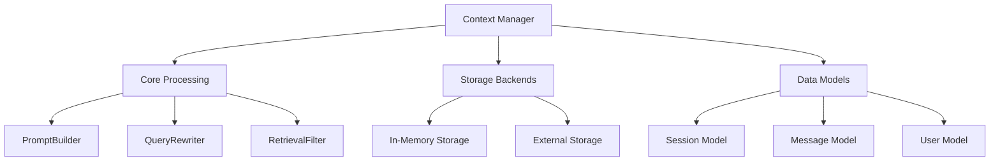
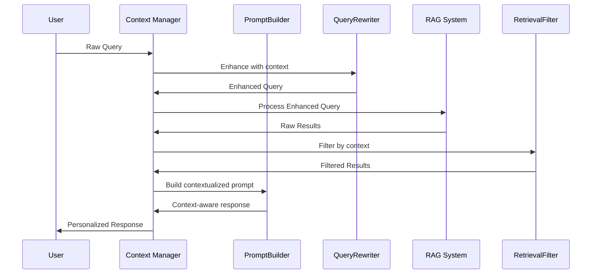
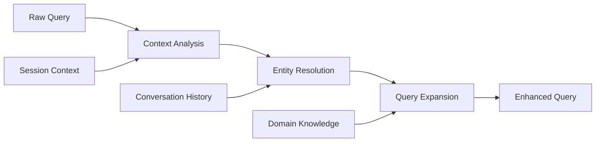
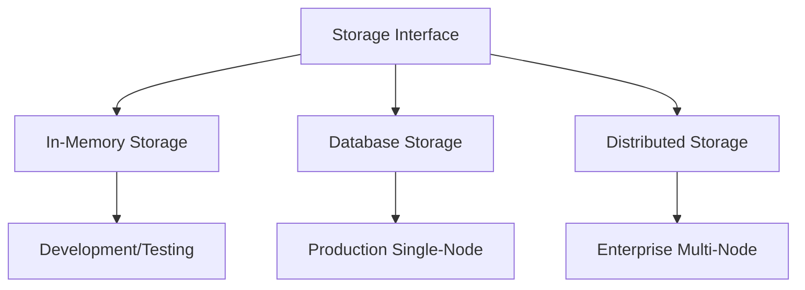
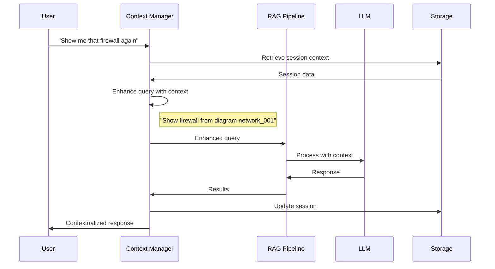

# Context Manager Architecture: Stateful Conversational Intelligence for RAG Systems

## Overview

The Context Manager represents a fundamental advancement in RAG system design, addressing the critical limitation of stateless query processing. This architecture enables persistent conversational state, user preference learning, and context-aware query enhancement, transforming isolated Q&A interactions into coherent, progressive conversations.

## Architectural Motivation

### The Stateless Limitation Problem

Traditional RAG systems suffer from **conversational amnesia** - each query is processed in isolation without awareness of previous interactions, user preferences, or ongoing context. This creates several critical limitations:

- **Repetitive Context Setting**: Users must re-establish context with each query
- **Inefficient Information Discovery**: Progressive exploration is impossible
- **Suboptimal User Experience**: No adaptation to user preferences or expertise levels
- **Lost Conversation Value**: Valuable context built during interactions is discarded

### Solution Architecture

The Context Manager solves these limitations through a **modular stateful architecture** that maintains conversation continuity while integrating seamlessly with existing RAG pipelines.



## Core Architecture Components

### Data Model Design

The foundation of conversational intelligence lies in sophisticated data modeling:

```python
@dataclass
class Session:
    session_id: str
    user_id: str
    diagram_id: Optional[str]
    active_entities: List[str]
    last_query_intent: str
    context_window: List[str]
    created_at: datetime
    last_activity: datetime
    metadata: Dict[str, Any]

@dataclass
class Message:
    message_id: str
    session_id: str
    content: str
    message_type: MessageType
    timestamp: datetime
    embeddings: Optional[List[float]]
    metadata: Dict[str, Any]

@dataclass
class User:
    user_id: str
    preferences: UserPreferences
    conversation_history: List[str]
    topic_interests: List[str]
    expertise_level: ExpertiseLevel
    learning_profile: Dict[str, Any]
```

### Core Processing Architecture



## PromptBuilder: Context-Aware Prompt Engineering

### Design Excellence

The PromptBuilder component transforms static prompts into dynamic, context-aware constructions that leverage conversational history and user preferences:

```python
class PromptBuilder:
    def build_context_prompt(
        self, 
        user_query: str,
        session: Session,
        retrieved_data: List[RetrievalResult],
        user_preferences: UserPreferences
    ) -> str:
        
        # Context integration strategy
        context_sections = [
            self._build_conversation_context(session),
            self._build_entity_context(session.active_entities),
            self._build_user_preference_context(user_preferences),
            self._build_retrieval_context(retrieved_data)
        ]
        
        return self._assemble_prompt(context_sections, user_query)
```

### Context Integration Patterns

**Conversation History Integration**:
```python
def _build_conversation_context(self, session: Session) -> str:
    recent_messages = session.get_recent_messages(limit=5)
    return f"""
    Recent conversation context:
    {self._format_conversation_history(recent_messages)}
    
    Current focus entities: {', '.join(session.active_entities)}
    Last query intent: {session.last_query_intent}
    """
```

**User Preference Adaptation**:
```python
def _adapt_for_user_preferences(self, base_prompt: str, prefs: UserPreferences) -> str:
    adaptations = {
        ExpertiseLevel.BEGINNER: "Provide detailed explanations with context",
        ExpertiseLevel.INTERMEDIATE: "Focus on practical implications",
        ExpertiseLevel.EXPERT: "Provide concise, technical details"
    }
    
    style_instruction = adaptations.get(prefs.expertise_level)
    return f"{base_prompt}\n\nResponse style: {style_instruction}"
```

## QueryRewriter: Intelligent Query Enhancement

### Contextual Query Transformation

The QueryRewriter component addresses the challenge of vague, context-dependent queries through intelligent enhancement:



### Implementation Architecture

```python
class QueryRewriter:
    def rewrite_with_context(
        self,
        raw_query: str,
        session: Session,
        conversation_history: List[Message]
    ) -> EnhancedQuery:
        
        # Multi-stage enhancement process
        analysis = self._analyze_query_intent(raw_query)
        entities = self._resolve_entity_references(raw_query, session)
        expansion = self._expand_with_context(raw_query, conversation_history)
        
        return EnhancedQuery(
            original=raw_query,
            enhanced=expansion,
            resolved_entities=entities,
            intent=analysis.intent,
            confidence=analysis.confidence
        )
```

### Pronoun and Reference Resolution

```python
def _resolve_entity_references(self, query: str, session: Session) -> Dict[str, str]:
    """
    Transform vague references into specific entities based on session context
    """
    resolutions = {}
    
    # Pronoun resolution patterns
    if "that" in query or "those" in query:
        resolutions.update(self._resolve_demonstrative_references(session))
    
    # Implicit entity resolution
    if session.active_entities:
        resolutions["implicit_context"] = session.active_entities[-1]
    
    return resolutions
```

## RetrievalFilter: Context-Aware Result Curation

### Intelligent Result Filtering

The RetrievalFilter component enhances retrieval quality through context-aware filtering and re-ranking:

```python
class RetrievalFilter:
    def filter_by_context(
        self,
        search_results: List[RetrievalResult],
        user_preferences: UserPreferences,
        session_context: Session,
        relevance_threshold: float = 0.7
    ) -> List[RetrievalResult]:
        
        # Multi-dimensional filtering strategy
        filtered_results = []
        
        for result in search_results:
            # Relevance scoring with context
            context_score = self._calculate_context_relevance(result, session_context)
            preference_score = self._calculate_preference_alignment(result, user_preferences)
            
            combined_score = (result.similarity_score * 0.6 + 
                            context_score * 0.3 + 
                            preference_score * 0.1)
            
            if combined_score >= relevance_threshold:
                result.contextualized_score = combined_score
                filtered_results.append(result)
        
        return sorted(filtered_results, key=lambda x: x.contextualized_score, reverse=True)
```

## Storage Backend Architecture

### Pluggable Storage Design

The Context Manager implements a pluggable storage architecture supporting multiple deployment scenarios:



### Storage Interface Design

```python
class StorageBackend(ABC):
    @abstractmethod
    async def store_session(self, session: Session) -> None: ...
    
    @abstractmethod
    async def retrieve_session(self, session_id: str) -> Optional[Session]: ...
    
    @abstractmethod
    async def store_message(self, message: Message) -> None: ...
    
    @abstractmethod
    async def get_conversation_history(
        self, session_id: str, limit: int = 50
    ) -> List[Message]: ...
```

### Performance-Optimized Implementation

```python
class ExternalStorage(StorageBackend):
    def __init__(self, connection_pool: ConnectionPool):
        self.pool = connection_pool
        self._session_cache = LRUCache(maxsize=1000)
    
    async def retrieve_session(self, session_id: str) -> Optional[Session]:
        # Check cache first
        if cached_session := self._session_cache.get(session_id):
            return cached_session
        
        # Database fallback
        async with self.pool.acquire() as conn:
            session_data = await conn.fetch_session(session_id)
            if session_data:
                session = Session.from_dict(session_data)
                self._session_cache[session_id] = session
                return session
        
        return None
```

## Integration Architecture

### RAG Pipeline Integration



### NetBot V2 Integration Pattern

```python
class ContextualNetBot:
    def __init__(self, context_manager: ContextManager):
        self.context_manager = context_manager
        self.rag_pipeline = RAGPipeline()
    
    async def query(
        self, 
        user_id: str,
        session_id: str,
        raw_query: str
    ) -> ContextualResponse:
        
        # Enhance query with context
        enhanced_query = await self.context_manager.enhance_query(
            session_id, raw_query
        )
        
        # Process through RAG pipeline
        rag_results = await self.rag_pipeline.process(enhanced_query)
        
        # Filter and contextualize results
        filtered_results = await self.context_manager.filter_results(
            session_id, rag_results
        )
        
        # Update session state
        await self.context_manager.update_session(
            session_id, raw_query, filtered_results
        )
        
        return ContextualResponse(
            results=filtered_results,
            context_used=enhanced_query.context_summary,
            session_updated=True
        )
```

## Performance and Scalability

### Caching Strategy

```python
class ContextCache:
    def __init__(self):
        self.session_cache = LRUCache(maxsize=10000)
        self.user_preference_cache = TTLCache(maxsize=5000, ttl=3600)
        self.query_enhancement_cache = LRUCache(maxsize=50000)
    
    async def get_enhanced_query(self, raw_query: str, context_hash: str):
        cache_key = f"{hash(raw_query)}:{context_hash}"
        return self.query_enhancement_cache.get(cache_key)
```

### Scalability Characteristics

```mermaid
graph LR
    A[Concurrent Sessions] --> A1[10,000+ sessions]
    B[Query Enhancement] --> B1[< 50ms latency]
    C[Context Retrieval] --> C1[< 20ms latency]
    D[Memory Usage] --> D1[O(1) per session]
```

## Advanced Features

### Implicit Learning System

```python
class ImplicitLearner:
    def analyze_interaction_patterns(self, user_id: str) -> UserInsights:
        """
        Learn user preferences from interaction patterns
        """
        interactions = self.get_user_interactions(user_id)
        
        preferences = {
            'response_depth': self._infer_depth_preference(interactions),
            'visual_preference': self._infer_visual_preference(interactions),
            'domain_expertise': self._infer_expertise_level(interactions)
        }
        
        return UserInsights(preferences)
```

### Cross-Session Learning

```python
def build_user_knowledge_graph(self, user_id: str) -> UserKnowledgeGraph:
    """
    Build comprehensive understanding of user's knowledge and interests
    """
    sessions = self.get_user_sessions(user_id)
    
    knowledge_graph = UserKnowledgeGraph()
    
    for session in sessions:
        # Extract knowledge areas from queries
        topics = self.extract_topics(session.messages)
        
        # Build competency model
        competencies = self.infer_competencies(session.query_complexity)
        
        knowledge_graph.add_topics(topics)
        knowledge_graph.update_competencies(competencies)
    
    return knowledge_graph
```

## Technical Benefits

### Conversational Intelligence

**Progressive Understanding**: Each interaction builds upon previous context, enabling complex multi-turn conversations that maintain coherence and purpose.

**User Adaptation**: The system learns and adapts to individual user preferences, communication styles, and expertise levels over time.

**Context Preservation**: Critical conversation state is maintained across sessions, enabling users to resume complex discussions seamlessly.

### Performance Advantages

**Query Optimization**: Context-enhanced queries are more precise, reducing retrieval noise and improving result relevance.

**Caching Efficiency**: Intelligent caching of context and preferences reduces computational overhead while maintaining responsiveness.

**Resource Utilization**: Efficient session management and storage optimization enable high-concurrency deployments.

## Future Enhancement Vectors

### Advanced Context Understanding

**Multi-Modal Context**: Integration of visual context from diagrams and documents into conversational state.

**Temporal Context**: Understanding of time-sensitive information and conversation evolution patterns.

**Collaborative Context**: Shared context across team members working on related topics.

### Predictive Capabilities

**Intent Prediction**: Anticipating user information needs based on conversation patterns and context.

**Proactive Assistance**: Suggesting relevant information before explicit requests based on contextual analysis.

**Conversation Optimization**: Automatically optimizing conversation flows for efficiency and user satisfaction.

## Conclusion

The Context Manager architecture represents a significant advancement in conversational AI system design, addressing fundamental limitations of stateless RAG systems through sophisticated context management and user modeling. The modular design ensures seamless integration with existing RAG pipelines while providing the foundation for advanced conversational intelligence capabilities.

This architecture enables the transition from simple query-response systems to sophisticated conversational partners that understand context, learn from interactions, and adapt to user needs - a critical capability for next-generation knowledge systems.