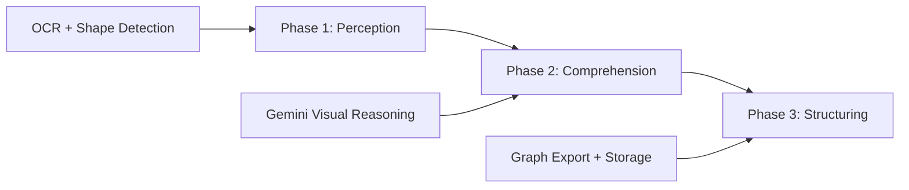
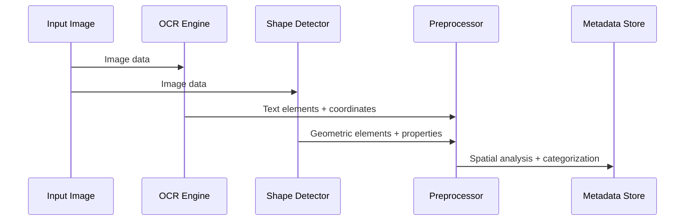
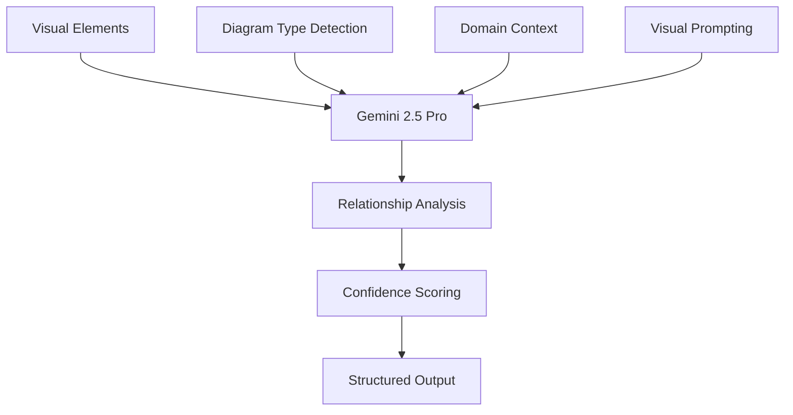
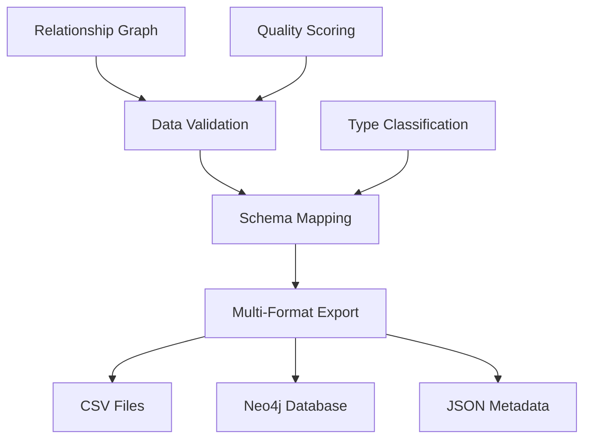
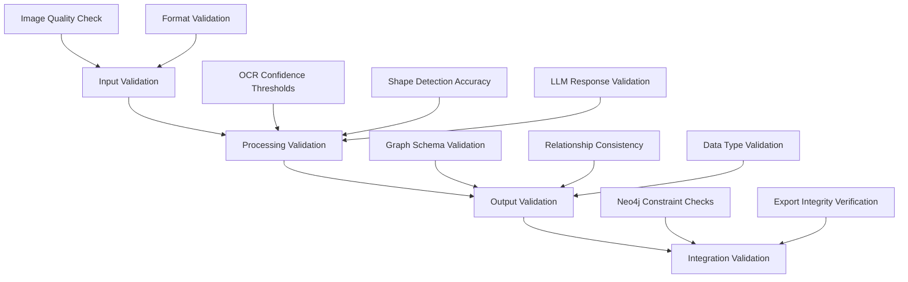
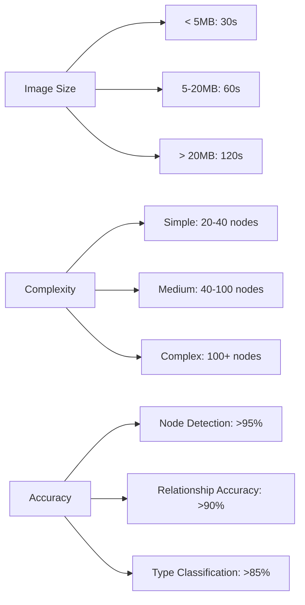

# Diagram Processing Architecture: Advanced Visual Intelligence Pipeline

## Overview

The Diagram Processing module represents a breakthrough in visual document understanding, transforming static network diagrams and flowcharts into structured, queryable knowledge graphs. This architecture combines state-of-the-art computer vision, advanced natural language processing, and robust data engineering to create a production-ready pipeline for visual knowledge extraction.

## Architectural Design Principles

### The Visual Intelligence Challenge

Traditional document processing systems excel at textual content but fail catastrophically when encountering visual information. Technical diagrams contain critical organizational knowledge encoded in:

- **Spatial Relationships**: Component positioning and layout patterns
- **Visual Symbology**: Industry-standard icons and notation systems  
- **Connection Semantics**: Relationship types expressed through line styles and arrows
- **Hierarchical Structure**: Layered information organization

### Solution Architecture

The Diagram Processing module addresses these challenges through a sophisticated **three-phase pipeline** that mirrors human expert analysis:



## Three-Phase Pipeline Architecture

### Phase 1: Visual Perception and Preprocessing

The perception phase implements multi-modal visual analysis combining optical character recognition with geometric shape detection:



#### OCR Integration Architecture

```python
class AdvancedOCRProcessor:
    def __init__(self, vision_client: VisionClient):
        self.vision_client = vision_client
        self.text_categorizer = TextCategorizer()
    
    async def extract_text_elements(self, image_data: bytes) -> List[TextElement]:
        # Google Cloud Vision API integration
        response = await self.vision_client.text_detection(image_data)
        
        text_elements = []
        for annotation in response.text_annotations:
            element = TextElement(
                content=annotation.description,
                bounding_box=annotation.bounding_poly,
                confidence=annotation.confidence,
                category=self.text_categorizer.categorize(annotation.description)
            )
            text_elements.append(element)
        
        return text_elements
```

#### Shape Detection Engine

```python
class ShapeDetectionEngine:
    def detect_geometric_elements(self, image: np.ndarray) -> List[Shape]:
        shapes = []
        
        # Multi-scale contour detection
        contours = self._detect_contours_multiscale(image)
        
        for contour in contours:
            shape_type = self._classify_shape(contour)
            properties = self._extract_properties(contour, shape_type)
            
            shapes.append(Shape(
                type=shape_type,
                coordinates=contour,
                properties=properties,
                confidence=self._calculate_confidence(contour, shape_type)
            ))
        
        return shapes
```

### Phase 2: Visual Reasoning and Relationship Generation

The comprehension phase leverages Gemini 2.5 Pro's advanced visual reasoning capabilities to understand spatial relationships and diagram semantics:



#### Advanced Prompt Engineering

```python
class GeminiVisualProcessor:
    def __init__(self):
        self.prompt_templates = {
            'network_diagram': self._load_network_prompt_template(),
            'flowchart': self._load_flowchart_prompt_template(),
            'mixed': self._load_hybrid_prompt_template()
        }
    
    async def generate_relationships(
        self, 
        image_data: bytes, 
        text_elements: List[TextElement],
        shapes: List[Shape],
        diagram_type: DiagramType
    ) -> RelationshipGraph:
        
        # Context-aware prompt construction
        prompt = self._build_contextual_prompt(
            diagram_type, text_elements, shapes
        )
        
        # Multi-shot prompting with examples
        enhanced_prompt = self._add_few_shot_examples(prompt, diagram_type)
        
        # Gemini API call with visual reasoning
        response = await self.gemini_client.generate_content(
            prompt=enhanced_prompt,
            image=image_data,
            model="gemini-2.5-pro-vision"
        )
        
        # Robust JSON parsing with fallback strategies
        return self._parse_response_robust(response.text)
```

#### Robust JSON Processing Architecture

```python
class LLMJsonParser:
    @staticmethod
    def parse_llm_response(response_text: str) -> Dict[str, Any]:
        """
        Multi-tiered JSON parsing with progressive fallback strategies
        """
        # Tier 1: Direct JSON parsing
        try:
            return json.loads(response_text)
        except json.JSONDecodeError:
            pass
        
        # Tier 2: Gentle cleaning
        cleaned = JsonCleaner.gentle_clean(response_text)
        try:
            return json.loads(cleaned)
        except json.JSONDecodeError:
            pass
        
        # Tier 3: Aggressive repair
        repaired = JsonRepairer.aggressive_repair(cleaned)
        try:
            return json.loads(repaired)
        except json.JSONDecodeError:
            pass
        
        # Tier 4: Regex extraction fallback
        return JsonExtractor.regex_fallback_extraction(response_text)
```

### Phase 3: Export and Knowledge Storage

The structuring phase transforms extracted relationships into multiple output formats optimized for different use cases:



#### Neo4j Integration Architecture

```python
class Neo4jExporter:
    def __init__(self, neo4j_client: Neo4jClient):
        self.client = neo4j_client
        self.schema_validator = GraphSchemaValidator()
    
    async def export_to_neo4j(
        self, 
        nodes: List[GraphNode], 
        relationships: List[GraphRelationship],
        diagram_id: str
    ) -> ExportResult:
        
        # Validate graph schema
        validation_result = self.schema_validator.validate(nodes, relationships)
        if not validation_result.is_valid:
            raise ValidationError(validation_result.errors)
        
        # Transactional batch insert
        async with self.client.session() as session:
            async with session.begin_transaction() as tx:
                # Create nodes with diagram partitioning
                for node in nodes:
                    await tx.run(
                        """
                        MERGE (n:Node {id: $id, diagram_id: $diagram_id})
                        SET n += $properties,
                            n.type = $type,
                            n.label = $label,
                            n.created_at = datetime()
                        """,
                        {
                            "id": node.id,
                            "diagram_id": diagram_id,
                            "properties": node.properties,
                            "type": node.type,
                            "label": node.label
                        }
                    )
                
                # Create relationships with metadata
                for rel in relationships:
                    await tx.run(
                        """
                        MATCH (a {id: $source_id, diagram_id: $diagram_id})
                        MATCH (b {id: $target_id, diagram_id: $diagram_id})
                        MERGE (a)-[r:RELATIONSHIP {type: $rel_type, diagram_id: $diagram_id}]->(b)
                        SET r += $properties,
                            r.created_at = datetime()
                        """,
                        {
                            "source_id": rel.source_id,
                            "target_id": rel.target_id,
                            "diagram_id": diagram_id,
                            "rel_type": rel.type,
                            "properties": rel.properties
                        }
                    )
                
                await tx.commit()
```

## Data Model Architecture

### Standardized Graph Representations

The module employs sophisticated data models that ensure consistency across the entire NetBot ecosystem:

```python
@dataclass
class GraphNode:
    id: str
    label: str
    type: str
    properties: Dict[str, Any]
    coordinates: Optional[Tuple[float, float]] = None
    confidence: float = 1.0
    metadata: Dict[str, Any] = field(default_factory=dict)

@dataclass  
class GraphRelationship:
    id: str
    source_id: str
    target_id: str
    type: str
    properties: Dict[str, Any] = field(default_factory=dict)
    confidence: float = 1.0
    metadata: Dict[str, Any] = field(default_factory=dict)

@dataclass
class Shape:
    type: ShapeType
    coordinates: List[Tuple[float, float]]
    properties: Dict[str, Any]
    confidence: float
    bounding_box: BoundingBox
```

### Pipeline Metadata Schema

```python
@dataclass
class PipelineMetadata:
    diagram_id: str
    processing_timestamp: datetime
    input_image_path: str
    diagram_type: DiagramType
    phase_results: Dict[str, PhaseResult]
    quality_metrics: QualityMetrics
    export_locations: Dict[str, str]
    processing_time: float
    error_log: List[ProcessingError]
```

## Quality Assurance Architecture

### Multi-Layer Validation System



### Error Recovery Mechanisms

```python
class ErrorRecoveryManager:
    def __init__(self):
        self.fallback_strategies = {
            'ocr_failure': self._ocr_fallback_strategy,
            'gemini_timeout': self._gemini_retry_strategy,
            'json_parse_error': self._json_recovery_strategy,
            'neo4j_connection_error': self._neo4j_retry_strategy
        }
    
    async def handle_processing_error(
        self, 
        error: ProcessingError, 
        context: ProcessingContext
    ) -> RecoveryResult:
        
        strategy = self.fallback_strategies.get(error.type)
        if strategy:
            return await strategy(error, context)
        
        # Generic fallback
        return RecoveryResult(
            success=False,
            fallback_data=self._extract_partial_results(context),
            error_message=f"No recovery strategy for {error.type}"
        )
```

## Performance and Scalability

### Processing Performance Characteristics



### Batch Processing Architecture

```python
class BatchProcessor:
    def __init__(self, max_concurrent: int = 5):
        self.semaphore = asyncio.Semaphore(max_concurrent)
        self.progress_tracker = ProgressTracker()
    
    async def process_batch(
        self, 
        image_paths: List[str],
        output_directory: str
    ) -> BatchResult:
        
        tasks = []
        for image_path in image_paths:
            task = self._process_with_semaphore(image_path, output_directory)
            tasks.append(task)
        
        # Process with progress tracking
        results = []
        for coro in asyncio.as_completed(tasks):
            result = await coro
            results.append(result)
            self.progress_tracker.update(len(results), len(tasks))
        
        return BatchResult(
            total_processed=len(results),
            successful=len([r for r in results if r.success]),
            failed=len([r for r in results if not r.success]),
            processing_time=self.progress_tracker.total_time
        )
```

## Integration Architecture

### Client Interface Design

```python
class DiagramProcessor:
    def __init__(self, 
                 gemini_api_key: str,
                 neo4j_config: Neo4jConfig,
                 vision_config: Optional[VisionConfig] = None):
        
        self.pipeline = KnowledgeGraphPipeline(
            gemini_api_key=gemini_api_key,
            neo4j_config=neo4j_config,
            vision_config=vision_config
        )
        
        self.quality_analyzer = QualityAnalyzer()
    
    async def process(
        self,
        image_path: str,
        diagram_id: str,
        output_dir: Optional[str] = None
    ) -> ProcessingResult:
        
        try:
            # Execute three-phase pipeline
            result = await self.pipeline.process_image(
                image_path=image_path,
                diagram_id=diagram_id,
                output_dir=output_dir
            )
            
            # Quality analysis
            quality_metrics = self.quality_analyzer.analyze(result)
            
            return ProcessingResult(
                status="success",
                nodes=result.nodes,
                relationships=result.relationships,
                quality_metrics=quality_metrics,
                metadata=result.metadata
            )
            
        except Exception as e:
            return ProcessingResult(
                status="error",
                error_message=str(e),
                partial_results=self._extract_partial_results()
            )
```

### NetBot V2 Integration

```python
# Seamless integration with NetBot ecosystem
from diagram_processing.client import DiagramProcessor

class NetBotIntegration:
    def __init__(self):
        self.diagram_processor = DiagramProcessor()
        self.embedding_manager = EmbeddingManager()
        self.graph_rag = GraphRAG()
    
    async def full_pipeline(self, image_path: str, diagram_id: str):
        # Phase 1: Process diagram
        processing_result = await self.diagram_processor.process(
            image_path, diagram_id
        )
        
        # Phase 2: Generate embeddings  
        await self.embedding_manager.add_embeddings(diagram_id)
        
        # Phase 3: Enable intelligent querying
        return await self.graph_rag.initialize_diagram(diagram_id)
```

## Technical Innovation Highlights

### Advanced Visual Reasoning

**Multi-Modal Analysis**: Combines OCR text extraction with geometric shape detection for comprehensive visual understanding.

**Context-Aware Processing**: Diagram type detection enables specialized processing strategies optimized for different visual formats.

**Confidence Scoring**: Every extracted element includes confidence metrics enabling quality-based filtering and validation.

### Robust Error Handling

**Progressive Fallback**: Multi-tiered JSON parsing ensures maximum data recovery even from imperfect LLM responses.

**Graceful Degradation**: Partial results are preserved and useful even when complete processing fails.

**Comprehensive Logging**: Detailed error tracking enables continuous improvement and debugging.

### Production-Ready Engineering

**Transactional Data Operations**: Atomic database operations ensure data consistency even during failure scenarios.

**Schema Validation**: Comprehensive validation prevents malformed data from entering the knowledge graph.

**Performance Monitoring**: Built-in metrics collection enables performance optimization and capacity planning.

## Future Enhancement Vectors

### Advanced Computer Vision

**Deep Learning Integration**: Custom neural networks trained on technical diagram datasets for improved accuracy.

**3D Diagram Processing**: Extension to isometric and 3D network diagrams with depth understanding.

**Multi-Page Document Processing**: Handling complex documents with multiple related diagrams.

### Enhanced AI Reasoning

**Temporal Diagram Analysis**: Understanding diagram evolution and change detection across versions.

**Cross-Diagram Relationship Discovery**: Identifying connections between separate diagrams in document sets.

**Automated Quality Assessment**: AI-powered evaluation of diagram completeness and accuracy.

### Scalability Improvements

**Distributed Processing**: Horizontal scaling across multiple processing nodes for enterprise workloads.

**Incremental Processing**: Smart reprocessing that only updates changed portions of diagrams.

**Real-Time Processing**: Stream processing capabilities for live diagram analysis.

## Conclusion

The Diagram Processing architecture represents a significant advancement in visual document intelligence, combining cutting-edge computer vision with sophisticated natural language processing to create a robust, production-ready system for extracting structured knowledge from visual information.

The three-phase design ensures comprehensive visual understanding while maintaining the flexibility and reliability required for enterprise deployment. Through its modular architecture and standardized interfaces, the system integrates seamlessly with the broader NetBot ecosystem while providing the foundation for future enhancements in visual AI capabilities.

This architecture transforms static visual documentation into dynamic, queryable knowledge assets, unlocking tremendous value for organizations whose critical information is encoded in diagrams, flowcharts, and technical schematics.