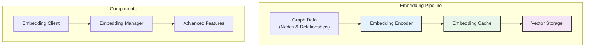

# NetBot V2 Embedding Module

The Embedding module provides semantic search capabilities for NetBot V2 by generating and managing vector embeddings for graph elements. It transforms structured graph data into high-dimensional vectors that enable natural language querying and semantic similarity search.

## Overview

The Embedding module bridges the gap between symbolic graph representations and semantic understanding by creating vector embeddings that capture the meaning and context of graph nodes and relationships.



## Module Structure

```
embeddings/
├── __init__.py                 # Module exports
├── cli.py                      # Embedding CLI interface
├── client.py                   # Main embedding client
├── embedding_encoder.py        # Core embedding generation
├── advanced/                   # Advanced embedding features
│   ├── __init__.py
│   ├── hybrid_manager.py       # Hybrid RAG management
│   ├── chunking/               # Document chunking
│   │   ├── __init__.py
│   │   ├── hybrid_chunker.py   # Multi-strategy chunking
│   │   └── models.py           # Chunking data models
│   └── vector_stores/          # Vector database integration
│       ├── __init__.py
│       ├── base_store.py       # Base vector store interface
│       └── chroma_store.py     # ChromaDB implementation
```

## Core Components

### 1. Embedding Client (`client.py`)

The main interface for embedding operations:

```python
from embeddings.client import EmbeddingManager

# Initialize embedding manager
embedding_manager = EmbeddingManager()

# Add embeddings to a processed diagram
success = embedding_manager.add_embeddings(
    diagram_id="network_001",
    batch_size=50,
    overwrite=False
)

# Check embedding status
diagrams_without_embeddings = embedding_manager.get_diagrams_without_embeddings()

# Bulk operations
results = embedding_manager.bulk_add_embeddings(
    diagram_ids=["diagram_001", "diagram_002"],
    batch_size=100
)

# Check status for multiple diagrams
status_map = embedding_manager.bulk_check_embeddings(
    diagram_ids=["diagram_001", "diagram_002", "diagram_003"]
)

embedding_manager.close()
```

**Key Features:**
- **Batch Processing**: Efficient processing of multiple nodes at once
- **Progress Tracking**: Real-time progress monitoring for large diagrams
- **Duplicate Detection**: Intelligent handling of existing embeddings
- **Bulk Operations**: Process multiple diagrams efficiently
- **Connection Management**: Proper resource cleanup and connection pooling

### 2. Embedding Encoder (`embedding_encoder.py`)

Core embedding generation using sentence-transformers:

```python
from embeddings.embedding_encoder import EmbeddingEncoder

# Initialize encoder
encoder = EmbeddingEncoder()

# Generate embeddings for text
text_embedding = encoder.encode_text("Load Balancer Network Device")

# Generate embeddings for graph nodes
node_embedding = encoder.encode_node(
    label="Load Balancer",
    node_type="network_device", 
    properties={"manufacturer": "F5", "model": "BIG-IP"}
)

# Batch encoding for efficiency
batch_embeddings = encoder.encode_batch([
    "Firewall Security Device",
    "Router Network Infrastructure", 
    "Switch Layer 2 Device"
])

# Get embedding metadata
model_info = encoder.get_model_info()
print(f"Model: {model_info['name']}, Dimensions: {model_info['dimensions']}")
```

**Encoding Features:**
- **Model**: Uses `all-MiniLM-L6-v2` (384 dimensions)
- **Text Processing**: Handles labels, types, and property concatenation
- **Batch Optimization**: Efficient processing of multiple items
- **Normalization**: L2-normalized vectors for cosine similarity
- **Consistency**: Deterministic encoding for reproducible results

### 3. Advanced Features (`advanced/`)

#### Hybrid Manager (`advanced/hybrid_manager.py`)

Advanced RAG system management combining multiple approaches:

```python
from embeddings.advanced.hybrid_manager import HybridRAGManager

# Initialize hybrid manager
hybrid_manager = HybridRAGManager(
    enable_chunking=True,
    enable_vector_stores=True,
    chunking_strategy="semantic"
)

# Process documents with multiple strategies
results = hybrid_manager.process_documents(
    documents=["document1.pdf", "document2.txt"],
    chunk_size=500,
    overlap=50
)

# Hybrid search combining multiple approaches
search_results = hybrid_manager.hybrid_search(
    query="network security architecture",
    top_k=10,
    combine_strategies=["dense", "sparse", "graph"]
)
```

#### Document Chunking (`advanced/chunking/`)

Sophisticated document processing for RAG integration:

```python
from embeddings.advanced.chunking.hybrid_chunker import HybridChunker

# Initialize chunker with multiple strategies
chunker = HybridChunker(
    strategies=["sentence", "semantic", "sliding_window"],
    chunk_size=512,
    overlap=50
)

# Process document with intelligent chunking
chunks = chunker.chunk_document(
    text=document_text,
    preserve_structure=True,
    min_chunk_size=100
)

# Chunk with metadata preservation
structured_chunks = chunker.chunk_with_metadata(
    document=document,
    include_headings=True,
    include_references=True
)
```

#### Vector Stores (`advanced/vector_stores/`)

Integration with external vector databases:

```python
from embeddings.advanced.vector_stores.chroma_store import ChromaStore

# Initialize ChromaDB store
chroma_store = ChromaStore(
    collection_name="netbot_embeddings",
    persist_directory="./vector_db"
)

# Store embeddings with metadata
chroma_store.add_embeddings(
    embeddings=node_embeddings,
    metadata=[
        {"diagram_id": "network_001", "node_type": "security"},
        {"diagram_id": "network_001", "node_type": "router"}
    ],
    ids=["node_1", "node_2"]
)

# Search similar embeddings
similar_items = chroma_store.similarity_search(
    query_embedding=query_vector,
    k=5,
    filter={"diagram_id": "network_001"}
)
```

## Embedding Process

### 1. Node Embedding Generation

```python
# For each graph node, create a comprehensive text representation
def create_node_text(node):
    text_parts = [
        node.label,                    # "Load Balancer"
        f"type: {node.type}",         # "type: network_device"
    ]
    
    # Add properties if available
    if node.properties:
        for key, value in node.properties.items():
            text_parts.append(f"{key}: {value}")
    
    return " ".join(text_parts)

# Generate embedding using sentence-transformers
node_text = create_node_text(node)
embedding = model.encode(node_text)
```

### 2. Storage in Neo4j

```cypher
// Update nodes with embedding vectors
MATCH (n {diagram_id: $diagram_id, id: $node_id})
SET n.embedding = $embedding_vector,
    n.embedding_model = $model_name,
    n.embedding_created = datetime()
RETURN n
```

### 3. Search and Retrieval

```python
# Convert query to embedding
query_embedding = encoder.encode_text("find security devices")

# Search for similar nodes using cosine similarity
similar_nodes = search_engine.find_similar(
    query_embedding=query_embedding,
    diagram_id="network_001",
    threshold=0.7,
    top_k=5
)
```

## CLI Interface

The Embedding module provides command-line tools for embedding management:

```bash
# Add embeddings to a diagram
python -m embeddings add diagram_001

# Add embeddings with custom batch size
python -m embeddings add diagram_001 --batch-size 100

# Check embedding status
python -m embeddings status diagram_001

# Bulk operations
python -m embeddings bulk-add diagram_001 diagram_002 diagram_003

# List diagrams without embeddings
python -m embeddings list-missing

# Advanced operations
python -m embeddings recompute diagram_001 --force
python -m embeddings export diagram_001 --format json
```

## Performance Optimization

### Caching Strategy

```python
from embeddings.cache import EmbeddingCache

# Initialize cache with LRU eviction
cache = EmbeddingCache(
    max_size=1000,
    ttl_seconds=3600  # 1 hour
)

# Cache embeddings for fast retrieval
cache.store_embeddings(diagram_id="network_001", embeddings=node_embeddings)

# Retrieve cached embeddings
cached_embeddings = cache.get_embeddings(diagram_id="network_001")
```

### Batch Processing

```python
# Process nodes in batches for efficiency
batch_size = 50
nodes = get_all_nodes(diagram_id)

for i in range(0, len(nodes), batch_size):
    batch = nodes[i:i + batch_size]
    
    # Create batch text representations
    batch_texts = [create_node_text(node) for node in batch]
    
    # Generate embeddings in batch (much faster)
    batch_embeddings = encoder.encode_batch(batch_texts)
    
    # Store batch in database
    store_embeddings_batch(batch, batch_embeddings)
```

### Memory Management

```python
# Streaming processing for large diagrams
def process_large_diagram(diagram_id, batch_size=100):
    total_nodes = count_nodes(diagram_id)
    processed = 0
    
    for batch in stream_nodes(diagram_id, batch_size):
        embeddings = generate_embeddings(batch)
        store_embeddings(embeddings)
        
        processed += len(batch)
        progress = (processed / total_nodes) * 100
        print(f"Progress: {progress:.1f}%")
```

## Integration with NetBot V2

### Automatic Embedding Management

```python
from client import NetBot

# NetBot automatically manages embeddings
netbot = NetBot()

# Process diagram (automatically generates embeddings if enabled)
result = netbot.process_diagram(
    image_path="network.png",
    auto_embeddings=True  # Automatically add embeddings after processing
)

# Search uses embeddings automatically when available
search_results = netbot.search(
    query="find load balancers",
    diagram_id="network_001",
    method="auto"  # Automatically selects vector search if embeddings exist
)
```

### Embedding Status Integration

```python
# Check which diagrams need embeddings
missing_embeddings = netbot.get_diagrams_without_embeddings()

# Bulk add embeddings to all processed diagrams
netbot.bulk_add_embeddings(missing_embeddings)
```

## Configuration

### Environment Variables

```bash
# Embedding model configuration
export EMBEDDING_MODEL="all-MiniLM-L6-v2"
export EMBEDDING_DEVICE="cpu"  # or "cuda" for GPU
export EMBEDDING_BATCH_SIZE=50

# Cache configuration
export EMBEDDING_CACHE_SIZE=1000
export EMBEDDING_CACHE_TTL=3600

# Performance settings
export EMBEDDING_MAX_WORKERS=4
export EMBEDDING_MEMORY_LIMIT=2048  # MB
```

### Configuration Object

```python
from embeddings.config import EmbeddingConfig

config = EmbeddingConfig(
    model_name="all-MiniLM-L6-v2",
    device="cpu",
    batch_size=50,
    normalize_vectors=True,
    cache_enabled=True,
    cache_size=1000,
    progress_reporting=True
)

embedding_manager = EmbeddingManager(config=config)
```

## Quality Metrics

### Embedding Quality Assessment

```python
# Check embedding quality for a diagram
quality_metrics = embedding_manager.assess_quality(diagram_id="network_001")

print(f"Coverage: {quality_metrics['coverage']:.2%}")
print(f"Consistency: {quality_metrics['consistency']:.3f}")
print(f"Dimensionality: {quality_metrics['dimensions']}")
print(f"Model Version: {quality_metrics['model_version']}")
```

### Search Performance

```python
# Benchmark search performance
benchmark_results = embedding_manager.benchmark_search(
    diagram_id="network_001",
    num_queries=100,
    query_types=["single_word", "phrase", "complex"]
)

print(f"Average Query Time: {benchmark_results['avg_time']:.3f}s")
print(f"Recall@5: {benchmark_results['recall_at_5']:.3f}")
print(f"Precision@5: {benchmark_results['precision_at_5']:.3f}")
```

## Current Capabilities

- ✅ **Automatic Embedding Generation**: Seamless integration with diagram processing
- ✅ **Semantic Search**: High-quality vector search using sentence-transformers
- ✅ **Batch Processing**: Efficient handling of large diagrams
- ✅ **Progress Tracking**: Real-time progress monitoring
- ✅ **Bulk Operations**: Process multiple diagrams simultaneously
- ✅ **Caching System**: Fast retrieval with intelligent caching
- ✅ **CLI Tools**: Command-line interface for advanced operations

## Future Enhancements

- **Custom Models**: Support for domain-specific embedding models
- **Multilingual Support**: Embeddings for non-English diagram content
- **Incremental Updates**: Update embeddings when graph data changes
- **Advanced Vector Stores**: Integration with Pinecone, Weaviate, Qdrant
- **Embedding Compression**: Reduce storage requirements while maintaining quality
- **Model Fine-tuning**: Adapt embeddings to specific network diagram vocabularies
- **Real-time Indexing**: Live embedding updates as data changes