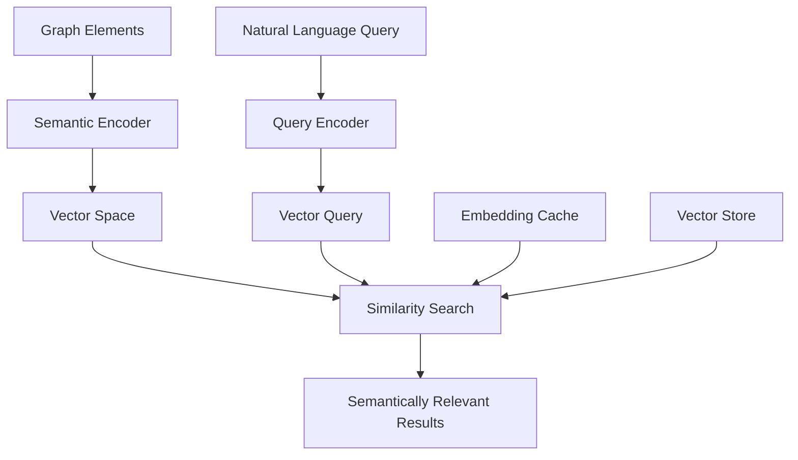
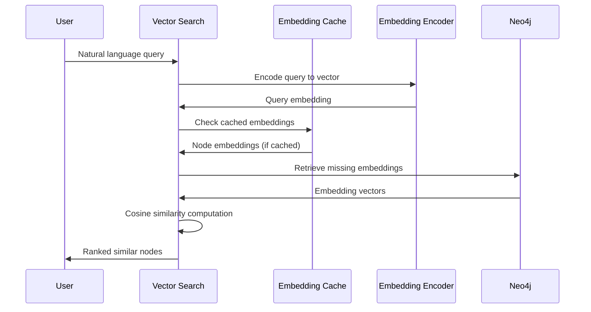
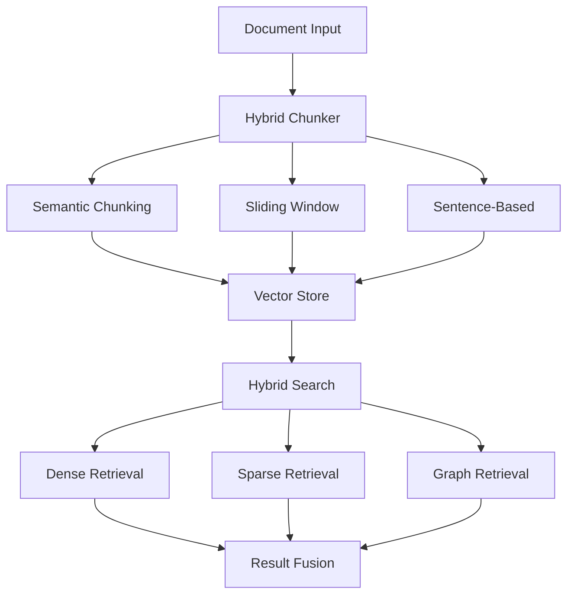
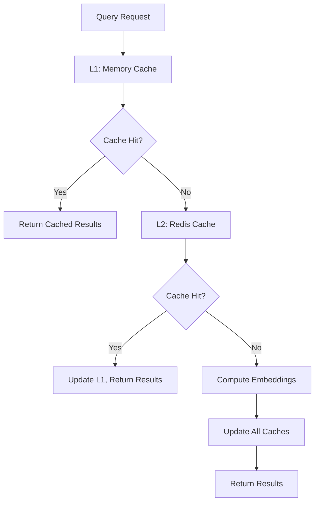

# Embeddings Architecture: Semantic Intelligence and Vector Search Infrastructure

## Overview

The Embeddings module establishes the semantic intelligence foundation for NetBot V2, transforming symbolic graph representations into high-dimensional vector spaces that enable natural language querying and semantic similarity search. This architecture bridges the semantic gap between human conceptual understanding and machine-readable graph data.

## Architectural Motivation

### The Semantic Understanding Challenge

Traditional graph databases excel at structural relationships but struggle with semantic queries. Users think in concepts like "security components" or "network vulnerabilities," while databases store literal labels like "Firewall_Device_001" or "IDS_System_Beta." This semantic disconnect creates several critical limitations:

- **Terminology Mismatch**: Users and documentation employ different vocabularies
- **Concept Relationships**: Related concepts may not share common keywords
- **Context Sensitivity**: Same terms have different meanings in different domains
- **Query Complexity**: Complex semantic queries require extensive manual query construction

### Solution Architecture

The Embeddings module solves these challenges through **semantic vector representation**, transforming graph elements into mathematical vectors that capture meaning, context, and relationships:



## Core Architecture Components

### Embedding Encoder Design

The heart of the system is a sophisticated encoding architecture that transforms textual representations into semantically meaningful vectors:

```python
class EmbeddingEncoder:
    def __init__(self, model_name: str = "all-MiniLM-L6-v2"):
        self.model = SentenceTransformer(model_name)
        self.dimension = self.model.get_sentence_embedding_dimension()
        self.device = self._select_optimal_device()
    
    def encode_node(
        self, 
        label: str, 
        node_type: str, 
        properties: Dict[str, Any]
    ) -> np.ndarray:
        """
        Transform graph node into semantic vector representation
        """
        # Construct comprehensive textual representation
        text_components = [
            label,
            f"type: {node_type}"
        ]
        
        # Incorporate property information
        if properties:
            for key, value in properties.items():
                if isinstance(value, (str, int, float)):
                    text_components.append(f"{key}: {value}")
        
        # Create unified text representation
        node_text = " ".join(text_components)
        
        # Generate embedding with normalization
        embedding = self.model.encode(
            node_text, 
            normalize_embeddings=True,
            convert_to_numpy=True
        )
        
        return embedding
    
    def encode_batch(self, texts: List[str]) -> np.ndarray:
        """
        Efficient batch encoding for performance optimization
        """
        return self.model.encode(
            texts,
            batch_size=32,
            normalize_embeddings=True,
            show_progress_bar=True,
            convert_to_numpy=True
        )
```

### Vector Search Architecture

The semantic search system implements efficient similarity computation with intelligent caching:



### Advanced Similarity Search Implementation

```python
class VectorSearch:
    def __init__(self, embedding_encoder: EmbeddingEncoder):
        self.encoder = embedding_encoder
        self.cache = EmbeddingCache()
        self.similarity_threshold = 0.7
    
    async def find_similar_nodes(
        self,
        query: str,
        diagram_id: str,
        top_k: int = 10,
        threshold: float = None
    ) -> List[SimilarityResult]:
        
        # Encode query to vector space
        query_embedding = self.encoder.encode_text(query)
        
        # Retrieve node embeddings with caching
        node_embeddings = await self._get_node_embeddings(diagram_id)
        
        # Compute similarity scores
        similarities = self._compute_cosine_similarities(
            query_embedding, node_embeddings
        )
        
        # Filter and rank results
        threshold = threshold or self.similarity_threshold
        results = []
        
        for node_id, similarity in similarities.items():
            if similarity >= threshold:
                results.append(SimilarityResult(
                    node_id=node_id,
                    similarity_score=similarity,
                    node_data=node_embeddings[node_id]['metadata']
                ))
        
        # Return top-k results sorted by similarity
        return sorted(results, key=lambda x: x.similarity_score, reverse=True)[:top_k]
    
    def _compute_cosine_similarities(
        self, 
        query_vec: np.ndarray, 
        node_embeddings: Dict[str, Dict]
    ) -> Dict[str, float]:
        """
        Efficient vectorized cosine similarity computation
        """
        # Stack all node embeddings
        embedding_matrix = np.stack([
            data['embedding'] for data in node_embeddings.values()
        ])
        
        # Vectorized cosine similarity
        similarities = np.dot(embedding_matrix, query_vec)
        
        # Map back to node IDs
        node_ids = list(node_embeddings.keys())
        return dict(zip(node_ids, similarities))
```

## Embedding Management Architecture

### Client Interface Design

The embedding management system provides comprehensive lifecycle management for embedding operations:

```python
class EmbeddingManager:
    def __init__(self, 
                 neo4j_client: Neo4jClient,
                 encoder: EmbeddingEncoder,
                 cache: Optional[EmbeddingCache] = None):
        
        self.neo4j_client = neo4j_client
        self.encoder = encoder
        self.cache = cache or EmbeddingCache()
        self.progress_tracker = ProgressTracker()
    
    async def add_embeddings(
        self, 
        diagram_id: str,
        batch_size: int = 50,
        overwrite: bool = False
    ) -> EmbeddingResult:
        """
        Generate and store embeddings for all nodes in a diagram
        """
        # Retrieve nodes requiring embeddings
        nodes = await self._get_nodes_for_embedding(diagram_id, overwrite)
        
        if not nodes:
            return EmbeddingResult(
                success=True,
                message=f"All nodes in {diagram_id} already have embeddings"
            )
        
        # Process in batches for efficiency
        total_processed = 0
        batch_results = []
        
        for batch in self._create_batches(nodes, batch_size):
            batch_result = await self._process_embedding_batch(
                batch, diagram_id
            )
            batch_results.append(batch_result)
            
            total_processed += len(batch)
            self.progress_tracker.update(total_processed, len(nodes))
        
        # Aggregate results
        successful = sum(len(br.successful_nodes) for br in batch_results)
        failed = sum(len(br.failed_nodes) for br in batch_results)
        
        return EmbeddingResult(
            success=failed == 0,
            nodes_processed=successful,
            nodes_failed=failed,
            processing_time=self.progress_tracker.elapsed_time
        )
```

### Batch Processing Optimization

```python
async def _process_embedding_batch(
    self, 
    nodes: List[GraphNode], 
    diagram_id: str
) -> BatchResult:
    """
    Optimized batch processing with error handling
    """
    try:
        # Prepare text representations
        node_texts = [
            self._create_node_text(node) for node in nodes
        ]
        
        # Batch encode for efficiency
        embeddings = self.encoder.encode_batch(node_texts)
        
        # Store embeddings in Neo4j transaction
        async with self.neo4j_client.session() as session:
            async with session.begin_transaction() as tx:
                successful_nodes = []
                failed_nodes = []
                
                for node, embedding in zip(nodes, embeddings):
                    try:
                        await tx.run(
                            """
                            MATCH (n {id: $node_id, diagram_id: $diagram_id})
                            SET n.embedding = $embedding,
                                n.embedding_model = $model_name,
                                n.embedding_created = datetime()
                            RETURN n.id as updated_id
                            """,
                            {
                                "node_id": node.id,
                                "diagram_id": diagram_id,
                                "embedding": embedding.tolist(),
                                "model_name": self.encoder.model_name
                            }
                        )
                        successful_nodes.append(node.id)
                        
                    except Exception as e:
                        failed_nodes.append((node.id, str(e)))
                
                await tx.commit()
                
                return BatchResult(
                    successful_nodes=successful_nodes,
                    failed_nodes=failed_nodes
                )
                
    except Exception as e:
        # Batch-level failure
        return BatchResult(
            successful_nodes=[],
            failed_nodes=[(node.id, str(e)) for node in nodes]
        )
```

## Advanced Features Architecture

### Hybrid RAG Management

The advanced features extend semantic capabilities to full document processing and multi-modal RAG systems:



### Multi-Strategy Chunking Architecture

```python
class HybridChunker:
    def __init__(self, strategies: List[str], chunk_size: int = 512):
        self.strategies = {
            'sentence': SentenceChunker(),
            'semantic': SemanticChunker(),
            'sliding_window': SlidingWindowChunker(chunk_size),
            'hierarchical': HierarchicalChunker()
        }
        self.active_strategies = [self.strategies[s] for s in strategies]
    
    def chunk_document(
        self, 
        text: str, 
        preserve_structure: bool = True
    ) -> List[DocumentChunk]:
        """
        Multi-strategy document chunking with metadata preservation
        """
        all_chunks = []
        
        for strategy in self.active_strategies:
            strategy_chunks = strategy.chunk(text)
            
            # Add strategy metadata
            for chunk in strategy_chunks:
                chunk.metadata['chunking_strategy'] = strategy.name
                chunk.metadata['preserve_structure'] = preserve_structure
            
            all_chunks.extend(strategy_chunks)
        
        # Deduplicate and merge overlapping chunks
        return self._merge_overlapping_chunks(all_chunks)
```

### Vector Store Integration

```python
class ChromaVectorStore:
    def __init__(self, collection_name: str, persist_directory: str):
        self.chroma_client = chromadb.PersistentClient(
            path=persist_directory
        )
        self.collection = self.chroma_client.get_or_create_collection(
            name=collection_name,
            metadata={"description": "NetBot semantic embeddings"}
        )
    
    async def add_embeddings(
        self,
        embeddings: List[np.ndarray],
        metadata: List[Dict[str, Any]],
        ids: List[str]
    ) -> None:
        """
        Store embeddings with rich metadata in ChromaDB
        """
        # Convert embeddings to lists for Chroma compatibility
        embedding_lists = [emb.tolist() for emb in embeddings]
        
        # Batch insert with metadata
        self.collection.add(
            embeddings=embedding_lists,
            metadatas=metadata,
            ids=ids
        )
    
    async def similarity_search(
        self,
        query_embedding: np.ndarray,
        k: int = 10,
        filter_metadata: Optional[Dict[str, Any]] = None
    ) -> List[SimilarityResult]:
        """
        Perform similarity search with optional metadata filtering
        """
        results = self.collection.query(
            query_embeddings=[query_embedding.tolist()],
            n_results=k,
            where=filter_metadata
        )
        
        return [
            SimilarityResult(
                id=id_val,
                similarity=distance,
                metadata=metadata
            )
            for id_val, distance, metadata in zip(
                results['ids'][0],
                results['distances'][0], 
                results['metadatas'][0]
            )
        ]
```

## Performance and Scalability Architecture

### Caching Strategy



### Multi-Level Caching Implementation

```python
class EmbeddingCache:
    def __init__(self, 
                 memory_size: int = 1000,
                 redis_client: Optional[Redis] = None,
                 ttl_seconds: int = 3600):
        
        # L1: In-memory LRU cache
        self.memory_cache = LRUCache(maxsize=memory_size)
        
        # L2: Redis distributed cache
        self.redis_client = redis_client
        self.ttl = ttl_seconds
        
        # Cache statistics
        self.stats = CacheStats()
    
    async def get_embeddings(
        self, 
        diagram_id: str
    ) -> Optional[Dict[str, np.ndarray]]:
        """
        Multi-level cache retrieval with statistics tracking
        """
        cache_key = f"embeddings:{diagram_id}"
        
        # L1 Cache check
        if cached_data := self.memory_cache.get(cache_key):
            self.stats.record_hit('memory')
            return cached_data
        
        # L2 Cache check
        if self.redis_client:
            redis_data = await self.redis_client.get(cache_key)
            if redis_data:
                embeddings = self._deserialize_embeddings(redis_data)
                # Populate L1 cache
                self.memory_cache[cache_key] = embeddings
                self.stats.record_hit('redis')
                return embeddings
        
        # Cache miss
        self.stats.record_miss()
        return None
    
    async def store_embeddings(
        self,
        diagram_id: str,
        embeddings: Dict[str, np.ndarray]
    ) -> None:
        """
        Store embeddings in all cache levels
        """
        cache_key = f"embeddings:{diagram_id}"
        
        # Store in L1 cache
        self.memory_cache[cache_key] = embeddings
        
        # Store in L2 cache
        if self.redis_client:
            serialized_data = self._serialize_embeddings(embeddings)
            await self.redis_client.setex(
                cache_key, self.ttl, serialized_data
            )
```

### Performance Monitoring

```python
class PerformanceMonitor:
    def __init__(self):
        self.metrics = defaultdict(list)
    
    def record_embedding_generation(
        self, 
        node_count: int, 
        processing_time: float,
        batch_size: int
    ) -> None:
        """
        Record performance metrics for optimization analysis
        """
        self.metrics['nodes_per_second'].append(node_count / processing_time)
        self.metrics['batch_efficiency'].append(batch_size / processing_time)
        self.metrics['processing_times'].append(processing_time)
    
    def record_search_performance(
        self,
        query_time: float,
        result_count: int,
        cache_hit_rate: float
    ) -> None:
        """
        Track search performance characteristics
        """
        self.metrics['search_latency'].append(query_time)
        self.metrics['result_relevance'].append(result_count)
        self.metrics['cache_efficiency'].append(cache_hit_rate)
    
    def generate_performance_report(self) -> PerformanceReport:
        """
        Generate comprehensive performance analysis
        """
        return PerformanceReport(
            avg_nodes_per_second=np.mean(self.metrics['nodes_per_second']),
            p95_search_latency=np.percentile(self.metrics['search_latency'], 95),
            cache_hit_rate=np.mean(self.metrics['cache_efficiency']),
            total_embeddings_generated=sum(self.metrics['result_relevance'])
        )
```

## Integration Patterns

### NetBot V2 Ecosystem Integration

```python
class SemanticGraphRAGIntegration:
    def __init__(self):
        self.embedding_manager = EmbeddingManager()
        self.vector_search = VectorSearch()
        self.graph_retrieval = GraphRetrieval()
    
    async def semantic_enhanced_search(
        self,
        query: str,
        diagram_id: str,
        method: str = "hybrid"
    ) -> SearchResult:
        """
        Combine semantic search with graph-based retrieval
        """
        if method in ["auto", "hybrid"]:
            # Check if embeddings are available
            has_embeddings = await self.embedding_manager.check_embeddings_exist(
                diagram_id
            )
            
            if has_embeddings:
                # Semantic search for initial candidates
                semantic_results = await self.vector_search.find_similar_nodes(
                    query, diagram_id, top_k=10
                )
                
                # Graph expansion from semantic seeds
                expanded_results = await self.graph_retrieval.expand_from_seeds(
                    [r.node_id for r in semantic_results], diagram_id
                )
                
                return SearchResult(
                    method="semantic_graph_hybrid",
                    primary_results=semantic_results,
                    expanded_results=expanded_results,
                    total_nodes=len(semantic_results) + len(expanded_results)
                )
            else:
                # Fallback to pure graph search
                return await self.graph_retrieval.cypher_search(query, diagram_id)
        
        elif method == "vector":
            return await self.vector_search.find_similar_nodes(query, diagram_id)
        
        elif method == "graph":
            return await self.graph_retrieval.cypher_search(query, diagram_id)
```

## Quality Assurance and Monitoring

### Embedding Quality Metrics

```python
class EmbeddingQualityAnalyzer:
    def assess_embedding_quality(
        self, 
        diagram_id: str
    ) -> QualityMetrics:
        """
        Comprehensive quality assessment of embeddings
        """
        embeddings = self._get_diagram_embeddings(diagram_id)
        
        # Coverage analysis
        total_nodes = self._count_diagram_nodes(diagram_id)
        embedded_nodes = len(embeddings)
        coverage = embedded_nodes / total_nodes
        
        # Consistency analysis
        consistency_score = self._analyze_embedding_consistency(embeddings)
        
        # Dimensionality verification
        expected_dims = self.encoder.dimension
        actual_dims = len(next(iter(embeddings.values())))
        
        # Model version tracking
        model_version = self._get_model_version(diagram_id)
        
        return QualityMetrics(
            coverage=coverage,
            consistency=consistency_score,
            dimensionality_match=(actual_dims == expected_dims),
            model_version=model_version,
            total_nodes=total_nodes,
            embedded_nodes=embedded_nodes
        )
```

## Future Enhancement Vectors

### Advanced Semantic Capabilities

**Domain-Specific Models**: Fine-tuned embedding models for specialized technical domains (networking, security, infrastructure).

**Contextual Embeddings**: Dynamic embeddings that adapt based on query context and user intent.

**Multi-Language Support**: Semantic understanding across different human languages for international deployments.

### Performance Optimizations

**GPU Acceleration**: CUDA-optimized embedding generation for high-throughput scenarios.

**Approximate Similarity Search**: FAISS or Annoy integration for sub-linear search complexity.

**Incremental Updates**: Smart re-embedding only when node content changes significantly.

### Advanced Integration Patterns

**Real-Time Embeddings**: Stream processing for live embedding updates as graphs change.

**Cross-Diagram Semantics**: Understanding semantic relationships across multiple diagrams.

**Federated Search**: Distributed semantic search across multiple NetBot instances.

## Conclusion

The Embeddings architecture establishes a robust semantic intelligence foundation that transforms NetBot V2 from a structural graph system into a semantically-aware knowledge platform. Through sophisticated vector representations, intelligent caching, and seamless integration patterns, this module enables natural language interaction with complex technical information.

The architecture's emphasis on performance optimization, quality assurance, and extensibility ensures that semantic capabilities scale effectively with organizational needs while maintaining the accuracy and responsiveness required for productive user interactions. This foundation enables the advanced query capabilities that make NetBot V2 a truly intelligent document understanding system.