# NetBot V2 GraphRAG Module

The GraphRAG module provides advanced graph-based retrieval capabilities for NetBot V2. It combines semantic vector search with graph traversal to find relevant information and generate natural language explanations with visualization support.

## Overview

GraphRAG bridges the gap between structured graph data and natural language queries by implementing a two-phase retrieval system that leverages both semantic similarity and graph connectivity.

```mermaid
graph TD
    subgraph "GraphRAG Architecture"
        CLIENT["GraphRAG Client"]
        RETRIEVAL["Two-Phase Retrieval"]
        SEARCH["Vector Search"]
        VIZ["Visualization"]
        DB["Database Layer"]
    end

    subgraph "Core Components"
        TPR["TwoPhaseRetriever"]
        VS["VectorSearch"]
        CG["CypherGenerator"]
        VF["VisualizationFactory"]
    end

    USER["👤 User Query"] --> CLIENT
    CLIENT --> RETRIEVAL
    RETRIEVAL --> SEARCH
    CLIENT --> VIZ
    CLIENT --> DB

    style CLIENT fill:#e3f2fd,stroke:#333,stroke-width:2px
    style RETRIEVAL fill:#e8f5e9,stroke:#333,stroke-width:2px
    style VIZ fill:#f3e5f5,stroke:#333,stroke-width:2px
```



## Module Structure

```
graph_rag/
├── __init__.py                 # Module exports
├── __main__.py                 # CLI entry point
├── cli.py                      # Specialized GraphRAG CLI
├── client.py                   # Main GraphRAG client
├── database/                   # Database operations
│   ├── __init__.py
│   ├── connection.py           # Neo4j connection management
│   ├── data_access.py          # Data access layer
│   ├── query_executor.py       # Query execution
│   └── schema_extractor.py     # Schema introspection
├── retrieval/                  # Two-phase retrieval system
│   ├── __init__.py
│   ├── cypher_generator.py     # Dynamic Cypher query generation
│   └── two_phase_retriever.py  # Main retrieval orchestrator
├── search/                     # Vector search capabilities
│   ├── __init__.py
│   ├── embedding_cache.py      # Embedding caching system
│   └── vector_search.py        # Semantic search implementation
└── visualization/              # Graph visualization
    ├── __init__.py
    ├── base.py                 # Base visualization interface
    ├── factory.py              # Visualization factory
    ├── graphviz_viz.py         # GraphViz backend
    └── networkx_viz.py         # NetworkX backend
```

## Core Components

### 1. GraphRAG Client (`client.py`)

The main interface for graph-based retrieval and querying:

```python
from graph_rag.client import GraphRAG

# Initialize GraphRAG
rag = GraphRAG()

# Search with natural language
results = rag.search(
    query="find load balancers", 
    diagram_id="network_001",
    method="auto",  # auto, vector, or cypher
    top_k=5
)

# Search with visualization
viz_results = rag.query_and_visualize(
    query="show network topology",
    diagram_id="network_001", 
    backend="graphviz",
    include_explanation=True
)

# Generate explanations
explanation = rag.explain(
    query="network architecture",
    diagram_id="network_001",
    detailed=True
)

rag.close()
```

**Key Features:**
- **Unified Interface**: Single client for all GraphRAG operations
- **Multiple Search Methods**: Automatic method selection based on available embeddings
- **Integrated Visualization**: Built-in support for generating visual diagrams
- **Natural Language Explanations**: AI-powered explanations of search results

### 2. Two-Phase Retrieval (`retrieval/two_phase_retriever.py`)

The heart of the GraphRAG system - combines semantic search with graph traversal:

```python
from graph_rag.retrieval.two_phase_retriever import TwoPhaseRetriever

retriever = TwoPhaseRetriever()

# Phase 1: Find semantically relevant seed nodes
# Phase 2: Expand context through graph traversal
subgraph = retriever.retrieve_subgraph(
    query="security components",
    diagram_id="network_001",
    max_nodes=10,
    similarity_threshold=0.6
)
```

**Retrieval Process:**

1. **Phase 1 - Semantic Search:**
   - Convert query to embedding
   - Find top-K similar nodes using cosine similarity
   - Filter by relevance threshold
   - Identify high-quality seed nodes

2. **Phase 2 - Graph Expansion:**
   - Start from seed nodes
   - Traverse relationships to find connected components
   - Build coherent subgraph maintaining structural integrity
   - Find multi-hop paths between orphaned nodes

**Algorithm Features:**
- **Hybrid Scoring**: Combines semantic similarity with graph connectivity
- **Context Preservation**: Maintains relationship context around relevant nodes
- **Orphan Detection**: Finds isolated nodes and connects them via graph paths
- **Quality Control**: Filters results by confidence scores and relevance

### 3. Vector Search (`search/vector_search.py`)

Semantic search implementation using embeddings:

```python
from graph_rag.search.vector_search import VectorSearch

search = VectorSearch()

# Initialize with embedding encoder
search.initialize_encoder()

# Perform semantic search
similar_nodes = search.find_similar_nodes(
    query="firewall security",
    diagram_id="network_001",
    top_k=5,
    threshold=0.7
)

# Get cached embeddings for fast search
cache_stats = search.get_cache_stats(diagram_id="network_001")
```

**Features:**
- **Embedding Model**: Uses sentence-transformers (`all-MiniLM-L6-v2`)
- **Efficient Caching**: Caches embeddings for fast repeated searches
- **Cosine Similarity**: High-quality semantic matching
- **Threshold Filtering**: Configurable relevance thresholds

### 4. Cypher Generator (`retrieval/cypher_generator.py`)

Dynamic Cypher query generation for different search patterns:

```python
from graph_rag.retrieval.cypher_generator import CypherGenerator

generator = CypherGenerator()

# Generate query for finding specific node types
cypher = generator.generate_find_query(
    node_types=["security", "firewall"],
    diagram_id="network_001",
    properties={"status": "active"}
)

# Generate traversal query
traversal = generator.generate_traversal_query(
    start_nodes=["node_1", "node_2"],
    max_depth=3,
    relationship_types=["CONNECTS_TO", "PROTECTS"]
)
```

**Query Types:**
- **Find Queries**: Locate nodes by type, properties, or labels
- **Traversal Queries**: Follow relationships with depth control
- **Aggregation Queries**: Count, group, and summarize graph data
- **Path Queries**: Find shortest paths between nodes

### 5. Visualization Factory (`visualization/factory.py`)

Multi-backend visualization system:

```python
from graph_rag.visualization.factory import VisualizationFactory

factory = VisualizationFactory()

# Create GraphViz visualization
graphviz_viz = factory.create_visualizer(
    backend="graphviz",
    output_format="png",
    layout="dot"
)

# Generate visualization
result = graphviz_viz.visualize_subgraph(
    nodes=search_results['nodes'],
    relationships=search_results['relationships'],
    title="Network Security Components",
    output_path="data/visualizations/security_graph.png"
)

# Create NetworkX visualization (for interactive/web use)
networkx_viz = factory.create_visualizer(
    backend="networkx", 
    output_format="html"
)
```

**Supported Backends:**
- **GraphViz**: High-quality static diagrams with professional layouts
- **NetworkX**: Interactive web visualizations with pyvis integration
- **Extensible**: Easy to add new visualization backends

**Visualization Features:**
- **Automatic Layout**: Intelligent node positioning
- **Color Coding**: Nodes colored by type/properties
- **Edge Labels**: Relationship types and properties
- **Legends**: Automatic legend generation
- **Responsive**: Scales well from small to large graphs

## Database Layer

### Connection Management (`database/connection.py`)

```python
from graph_rag.database.connection import Neo4jConnection

# Managed connection with automatic cleanup
conn = Neo4jConnection()
with conn.get_session() as session:
    result = session.run("MATCH (n) RETURN count(n)")
    
# Connection pooling and health checks built-in
```

### Data Access (`database/data_access.py`)

```python
from graph_rag.database.data_access import GraphDataAccess

data_access = GraphDataAccess()

# Get all nodes for a diagram
nodes = data_access.get_nodes_by_diagram(diagram_id="network_001")

# Get relationships with filtering
relationships = data_access.get_relationships(
    diagram_id="network_001",
    relationship_types=["CONNECTS_TO", "PROTECTS"]
)

# Check embedding availability
has_embeddings = data_access.check_embeddings_exist(diagram_id="network_001")
```

## CLI Interface

The GraphRAG module provides a specialized CLI for advanced operations:

```bash
# Search operations
python -m graph_rag search "find load balancers" network_001
python -m graph_rag search "security components" network_001 --method vector

# Visualization
python -m graph_rag visualize "network topology" network_001 --backend graphviz
python -m graph_rag visualize "show connections" network_001 --backend networkx --output results.html

# Explanations
python -m graph_rag explain "network architecture" network_001 --detailed
python -m graph_rag explain "security design" network_001 --save-to report.md
```

## Integration with NetBot V2

GraphRAG integrates seamlessly with the NetBot ecosystem:

```python
from client import NetBot

# NetBot automatically uses GraphRAG for search
netbot = NetBot()

# Search methods automatically route to GraphRAG
results = netbot.search("find routers", "network_001", method="auto")

# Visualization methods use GraphRAG visualization
viz_results = netbot.query_and_visualize(
    "show topology", 
    "network_001", 
    backend="graphviz"
)
```

## Performance Characteristics

- **Embedding Cache**: Sub-second search on cached embeddings
- **Graph Traversal**: Efficient path finding with depth limits
- **Memory Management**: Streaming results for large graphs
- **Connection Pooling**: Optimized database connection reuse
- **Batch Processing**: Bulk operations for multiple diagrams

## Configuration

GraphRAG supports flexible configuration:

```python
# Via environment variables
export GRAPHRAG_SIMILARITY_THRESHOLD=0.7
export GRAPHRAG_MAX_SUBGRAPH_NODES=20
export GRAPHRAG_CACHE_SIZE=1000

# Via configuration object
from graph_rag.config import GraphRAGConfig

config = GraphRAGConfig(
    similarity_threshold=0.6,
    max_nodes=15,
    enable_caching=True,
    default_backend="graphviz"
)

rag = GraphRAG(config=config)
```

## Current Capabilities

- ✅ **Two-Phase Retrieval**: Semantic + graph-based search
- ✅ **Multi-Backend Visualization**: GraphViz and NetworkX support
- ✅ **Natural Language Explanations**: AI-powered result interpretation
- ✅ **Embedding Integration**: Vector search with caching
- ✅ **CLI Interface**: Command-line tools for advanced operations
- ✅ **Performance Optimization**: Caching and connection pooling

## Future Enhancements

- **Advanced Graph Algorithms**: PageRank, community detection, centrality measures
- **Multi-Diagram Queries**: Cross-diagram relationship discovery
- **Real-time Updates**: Live graph updates and incremental indexing
- **Advanced Visualizations**: 3D layouts, interactive timelines, hierarchical views
- **Query Optimization**: Intelligent query planning and caching strategies
- **Custom Embeddings**: Domain-specific embedding models for specialized use cases