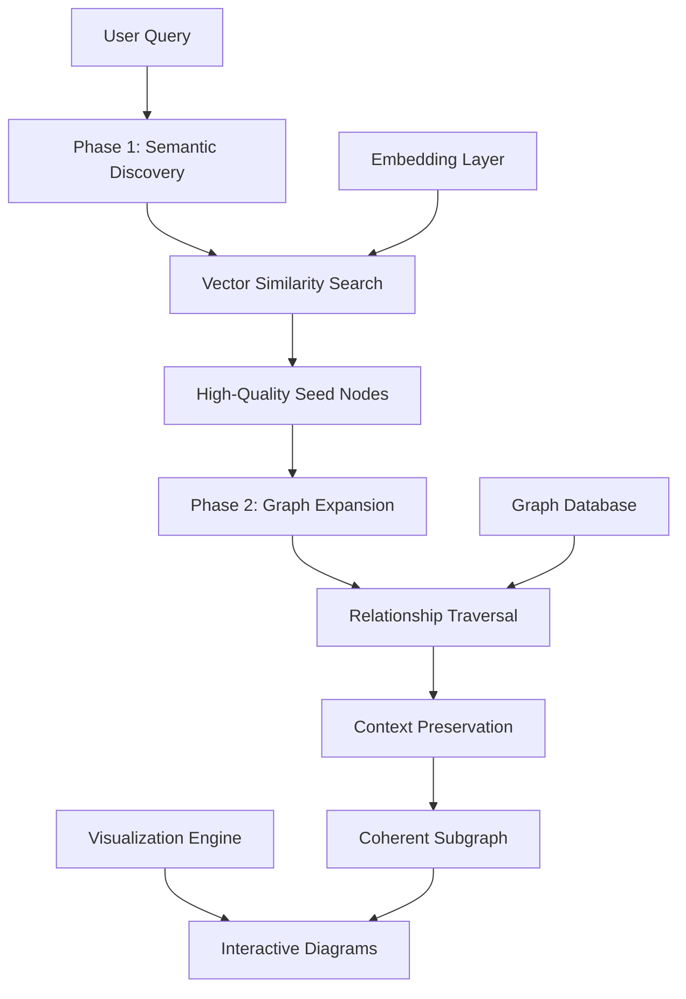
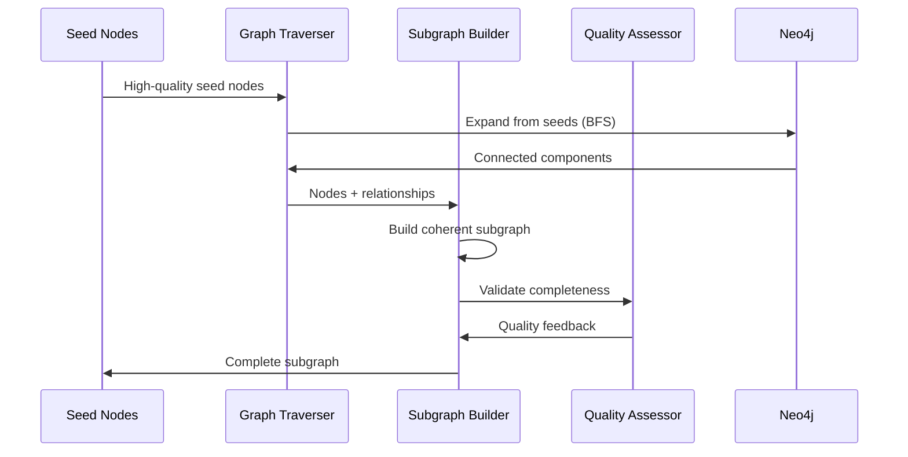
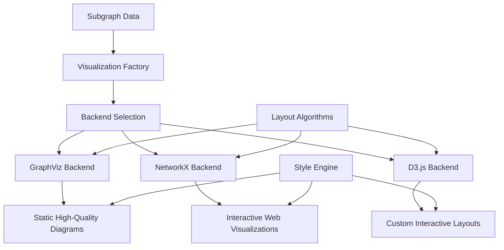

# GraphRAG Architecture: Advanced Graph-Based Retrieval and Visualization System

## Overview

The GraphRAG module represents the culmination of semantic intelligence and graph-based reasoning, implementing a sophisticated two-phase retrieval system that combines vector similarity search with graph traversal algorithms. This architecture addresses the fundamental limitation of traditional RAG systems that treat information as isolated fragments, instead leveraging the rich relationship structure inherent in knowledge graphs.

## Architectural Foundation

### The Relationship Intelligence Challenge

Traditional retrieval systems excel at finding semantically relevant documents but fail to understand how information pieces relate within larger systems. When users ask complex questions like "What systems would be affected if the main database fails?", they need:

- **Semantic Relevance**: Information related to databases and failure scenarios
- **Relationship Context**: Understanding of system dependencies and cascading effects  
- **Structural Completeness**: Complete subgraphs that preserve logical connectivity
- **Visual Representation**: Clear diagrams showing relationships and impacts

### Two-Phase Retrieval Architecture

GraphRAG solves these challenges through an innovative two-phase approach that combines the best of semantic search with graph-based reasoning:



## Core Architecture Components

### Two-Phase Retriever Design

The heart of GraphRAG is the sophisticated two-phase retrieval system that ensures both semantic relevance and structural coherence:

```python
class TwoPhaseRetriever:
    def __init__(self, 
                 vector_search: VectorSearch,
                 graph_client: Neo4jClient,
                 config: RetrievalConfig):
        
        self.vector_search = vector_search
        self.graph_client = graph_client
        self.config = config
        self.subgraph_builder = SubgraphBuilder()
        
    async def retrieve_subgraph(
        self,
        query: str,
        diagram_id: str,
        max_nodes: int = 15,
        similarity_threshold: float = 0.6
    ) -> RetrievalResult:
        """
        Two-phase retrieval: semantic discovery + graph expansion
        """
        # Phase 1: Semantic seed discovery
        semantic_results = await self._phase1_semantic_discovery(
            query, diagram_id, similarity_threshold
        )
        
        if not semantic_results:
            # Fallback to pure graph search
            return await self._fallback_cypher_search(query, diagram_id)
        
        # Phase 2: Graph-aware expansion
        expanded_subgraph = await self._phase2_graph_expansion(
            semantic_results, diagram_id, max_nodes
        )
        
        # Quality scoring and validation
        quality_score = self._calculate_subgraph_quality(
            expanded_subgraph, query
        )
        
        return RetrievalResult(
            nodes=expanded_subgraph.nodes,
            relationships=expanded_subgraph.relationships,
            seed_nodes=semantic_results,
            quality_score=quality_score,
            retrieval_method="two_phase_semantic_graph"
        )
```

### Phase 1: Semantic Discovery Engine

The first phase leverages advanced embedding-based similarity search to identify semantically relevant starting points:

```python
async def _phase1_semantic_discovery(
    self,
    query: str,
    diagram_id: str,
    threshold: float
) -> List[SemanticMatch]:
    """
    Identify high-quality semantic seed nodes for graph expansion
    """
    # Multi-strategy semantic search
    similarity_results = await self.vector_search.find_similar_nodes(
        query=query,
        diagram_id=diagram_id,
        top_k=self.config.max_seed_nodes,
        threshold=threshold
    )
    
    # Filter and score candidates
    quality_seeds = []
    for result in similarity_results:
        # Calculate composite quality score
        quality_score = self._calculate_seed_quality(
            result, query, diagram_id
        )
        
        if quality_score >= self.config.seed_quality_threshold:
            quality_seeds.append(SemanticMatch(
                node_id=result.node_id,
                similarity_score=result.similarity_score,
                quality_score=quality_score,
                node_data=result.node_data
            ))
    
    return quality_seeds
```

### Phase 2: Graph Expansion Engine

The second phase performs intelligent graph traversal to build coherent, contextually complete subgraphs:



```python
async def _phase2_graph_expansion(
    self,
    seed_nodes: List[SemanticMatch],
    diagram_id: str,
    max_nodes: int
) -> Subgraph:
    """
    Intelligent graph expansion preserving relationship context
    """
    subgraph = Subgraph()
    explored_nodes = set()
    priority_queue = PriorityQueue()
    
    # Initialize with seed nodes
    for seed in seed_nodes:
        subgraph.add_node(seed.node_data)
        priority_queue.put((seed.quality_score, seed.node_id))
        explored_nodes.add(seed.node_id)
    
    # Breadth-first expansion with quality scoring
    while not priority_queue.empty() and len(subgraph.nodes) < max_nodes:
        current_score, current_node = priority_queue.get()
        
        # Find connected nodes
        connected_nodes = await self._get_connected_nodes(
            current_node, diagram_id
        )
        
        for connected_node in connected_nodes:
            if connected_node.id not in explored_nodes:
                # Calculate expansion priority
                expansion_score = self._calculate_expansion_score(
                    connected_node, subgraph, seed_nodes
                )
                
                if expansion_score >= self.config.expansion_threshold:
                    subgraph.add_node(connected_node)
                    subgraph.add_relationship(
                        current_node, connected_node.id
                    )
                    priority_queue.put((expansion_score, connected_node.id))
                    explored_nodes.add(connected_node.id)
    
    # Post-processing: connect orphaned high-value nodes
    orphaned_nodes = self._find_orphaned_nodes(subgraph, seed_nodes)
    connected_subgraph = await self._connect_orphaned_nodes(
        subgraph, orphaned_nodes, diagram_id
    )
    
    return connected_subgraph
```

### Advanced Scoring Algorithms

GraphRAG employs sophisticated scoring mechanisms that balance semantic relevance with graph connectivity:

```python
def _calculate_expansion_score(
    self,
    candidate_node: GraphNode,
    current_subgraph: Subgraph,
    seed_nodes: List[SemanticMatch]
) -> float:
    """
    Multi-factor scoring for graph expansion decisions
    """
    scores = {}
    
    # Semantic relevance to original query
    scores['semantic'] = self._semantic_relevance_score(
        candidate_node, seed_nodes
    )
    
    # Connectivity importance within subgraph
    scores['connectivity'] = self._connectivity_score(
        candidate_node, current_subgraph
    )
    
    # Information richness (properties, relationships)
    scores['richness'] = self._information_richness_score(candidate_node)
    
    # Structural importance (centrality measures)
    scores['centrality'] = self._structural_importance_score(
        candidate_node, current_subgraph
    )
    
    # Weighted combination
    weights = self.config.scoring_weights
    final_score = sum(
        weights[factor] * score 
        for factor, score in scores.items()
    )
    
    return final_score

def _connectivity_score(
    self, 
    node: GraphNode, 
    subgraph: Subgraph
) -> float:
    """
    Score based on how well the node connects existing subgraph components
    """
    existing_connections = 0
    potential_bridges = 0
    
    for existing_node in subgraph.nodes:
        if self._nodes_connected(node, existing_node):
            existing_connections += 1
            
        # Check if this node bridges disconnected components
        if self._creates_bridge(node, existing_node, subgraph):
            potential_bridges += 1
    
    # Higher score for nodes that connect many existing nodes
    # Extra bonus for nodes that bridge disconnected components
    connectivity_ratio = existing_connections / len(subgraph.nodes)
    bridge_bonus = potential_bridges * 0.2
    
    return min(1.0, connectivity_ratio + bridge_bonus)
```

## Visualization Architecture

### Multi-Backend Visualization System

GraphRAG implements a sophisticated visualization architecture supporting multiple rendering backends optimized for different use cases:



### Advanced Visualization Factory

```python
class VisualizationFactory:
    def __init__(self):
        self.backends = {
            'graphviz': GraphVizVisualizer,
            'networkx': NetworkXVisualizer,
            'd3': D3Visualizer,
            'plotly': PlotlyVisualizer
        }
        self.style_engine = StyleEngine()
    
    def create_visualizer(
        self,
        backend: str,
        config: VisualizationConfig
    ) -> BaseVisualizer:
        """
        Factory method for creating configured visualizers
        """
        if backend not in self.backends:
            raise ValueError(f"Unsupported backend: {backend}")
        
        visualizer_class = self.backends[backend]
        visualizer = visualizer_class(config)
        
        # Apply styling configuration
        visualizer.style_engine = self.style_engine
        visualizer.apply_style_theme(config.theme)
        
        return visualizer
    
    async def generate_visualization(
        self,
        subgraph: Subgraph,
        query_context: str,
        backend: str = "auto"
    ) -> VisualizationResult:
        """
        Generate optimized visualization based on subgraph characteristics
        """
        # Auto-select backend based on subgraph properties
        if backend == "auto":
            backend = self._select_optimal_backend(subgraph)
        
        visualizer = self.create_visualizer(backend, self._get_default_config())
        
        # Generate visualization with context-aware styling
        viz_result = await visualizer.visualize_subgraph(
            nodes=subgraph.nodes,
            relationships=subgraph.relationships,
            title=f"Results for: {query_context}",
            highlight_seeds=subgraph.seed_nodes
        )
        
        return viz_result
```

### GraphViz Integration for High-Quality Outputs

```python
class GraphVizVisualizer(BaseVisualizer):
    def __init__(self, config: VisualizationConfig):
        self.config = config
        self.layout_engine = config.layout or "dot"
        self.style_mappings = self._load_style_mappings()
    
    async def visualize_subgraph(
        self,
        nodes: List[GraphNode],
        relationships: List[GraphRelationship],
        title: str,
        highlight_seeds: List[str] = None
    ) -> VisualizationResult:
        """
        Generate high-quality static diagram using GraphViz
        """
        # Create GraphViz graph
        graph = graphviz.Digraph(
            comment=title,
            format=self.config.output_format,
            engine=self.layout_engine
        )
        
        # Configure graph attributes
        graph.attr(
            rankdir=self.config.direction,
            bgcolor='transparent',
            splines='ortho',
            nodesep='0.8',
            ranksep='1.0'
        )
        
        # Add nodes with intelligent styling
        for node in nodes:
            node_style = self._get_node_style(node, highlight_seeds)
            graph.node(
                node.id,
                label=self._format_node_label(node),
                **node_style
            )
        
        # Add relationships with semantic styling
        for rel in relationships:
            edge_style = self._get_edge_style(rel)
            graph.edge(
                rel.source_id,
                rel.target_id,
                label=rel.type,
                **edge_style
            )
        
        # Generate output
        output_path = self._generate_output_path(title)
        graph.render(output_path, cleanup=True)
        
        return VisualizationResult(
            file_path=f"{output_path}.{self.config.output_format}",
            format=self.config.output_format,
            backend="graphviz",
            node_count=len(nodes),
            edge_count=len(relationships)
        )
```

## Database Architecture and Query Optimization

### Advanced Cypher Generation

GraphRAG implements dynamic Cypher query generation optimized for different search patterns and performance characteristics:

```python
class CypherGenerator:
    def __init__(self):
        self.query_templates = self._load_query_templates()
        self.performance_optimizer = QueryOptimizer()
    
    def generate_traversal_query(
        self,
        start_nodes: List[str],
        max_depth: int = 3,
        relationship_types: List[str] = None,
        node_filters: Dict[str, Any] = None
    ) -> str:
        """
        Generate optimized traversal queries for graph expansion
        """
        # Build relationship pattern
        rel_pattern = ""
        if relationship_types:
            type_pattern = "|".join(relationship_types)
            rel_pattern = f"[r:{type_pattern}]"
        else:
            rel_pattern = "[r]"
        
        # Build node filters
        filter_clauses = []
        if node_filters:
            for key, value in node_filters.items():
                filter_clauses.append(f"n.{key} = ${key}")
        
        filter_clause = "WHERE " + " AND ".join(filter_clauses) if filter_clauses else ""
        
        # Construct optimized query
        query = f"""
        WITH $start_nodes as start_ids
        UNWIND start_ids as start_id
        MATCH (start {{id: start_id, diagram_id: $diagram_id}})
        MATCH path = (start)-{rel_pattern}*1..{max_depth}-(n {{diagram_id: $diagram_id}})
        {filter_clause}
        WITH nodes(path) as path_nodes, relationships(path) as path_rels
        UNWIND path_nodes as node
        UNWIND path_rels as rel
        RETURN DISTINCT 
            node.id as node_id,
            node.label as node_label,
            node.type as node_type,
            node.properties as node_properties,
            rel.id as rel_id,
            rel.type as rel_type,
            rel.source_id as rel_source,
            rel.target_id as rel_target,
            rel.properties as rel_properties
        ORDER BY node.label
        """
        
        return self.performance_optimizer.optimize_query(query)
```

### Connection Management and Performance

```python
class Neo4jConnectionManager:
    def __init__(self, uri: str, auth: Tuple[str, str]):
        self.driver = GraphDatabase.driver(uri, auth=auth)
        self.connection_pool = ConnectionPool(max_size=20)
        self.query_cache = QueryCache(max_size=1000)
        
    async def execute_query(
        self,
        query: str,
        parameters: Dict[str, Any],
        timeout: int = 30
    ) -> List[Record]:
        """
        Execute optimized queries with connection pooling and caching
        """
        # Check query cache
        cache_key = self._generate_cache_key(query, parameters)
        if cached_result := self.query_cache.get(cache_key):
            return cached_result
        
        # Execute with connection pooling
        async with self.connection_pool.acquire() as session:
            try:
                result = await session.run(
                    query, 
                    parameters,
                    timeout=timeout
                )
                records = await result.data()
                
                # Cache successful results
                self.query_cache.set(cache_key, records, ttl=300)
                
                return records
                
            except Exception as e:
                # Log error and re-raise
                logger.error(f"Query execution failed: {e}")
                raise QueryExecutionError(f"Failed to execute query: {e}")
```

## Advanced Features and Capabilities

### Intelligent Result Explanation

GraphRAG provides AI-powered explanation generation that helps users understand why specific results were returned:

```python
class ResultExplainer:
    def __init__(self, llm_client: LLMClient):
        self.llm_client = llm_client
        self.explanation_templates = self._load_templates()
    
    async def explain_retrieval_results(
        self,
        query: str,
        subgraph: Subgraph,
        seed_nodes: List[SemanticMatch],
        detailed: bool = False
    ) -> ExplanationResult:
        """
        Generate natural language explanations of retrieval results
        """
        # Prepare context for explanation
        context = {
            "original_query": query,
            "seed_nodes": [
                {"label": node.node_data.label, "relevance": node.similarity_score}
                for node in seed_nodes
            ],
            "total_nodes": len(subgraph.nodes),
            "total_relationships": len(subgraph.relationships),
            "key_relationships": self._extract_key_relationships(subgraph)
        }
        
        # Select appropriate explanation template
        template = (self.explanation_templates["detailed"] 
                   if detailed 
                   else self.explanation_templates["summary"])
        
        # Generate explanation using LLM
        explanation_prompt = template.format(**context)
        
        explanation = await self.llm_client.generate_explanation(
            prompt=explanation_prompt,
            max_tokens=500 if detailed else 200
        )
        
        return ExplanationResult(
            explanation=explanation,
            confidence=self._calculate_explanation_confidence(context),
            key_insights=self._extract_key_insights(subgraph),
            follow_up_suggestions=self._generate_follow_up_questions(query, subgraph)
        )
```

### Performance Analytics and Optimization

```python
class PerformanceAnalyzer:
    def __init__(self):
        self.metrics_collector = MetricsCollector()
        self.optimization_advisor = OptimizationAdvisor()
    
    def analyze_retrieval_performance(
        self,
        retrieval_results: List[RetrievalResult],
        time_window: timedelta = timedelta(hours=24)
    ) -> PerformanceReport:
        """
        Analyze retrieval performance and suggest optimizations
        """
        # Collect performance metrics
        metrics = self.metrics_collector.collect_metrics(
            retrieval_results, time_window
        )
        
        # Performance analysis
        analysis = {
            'avg_retrieval_time': np.mean(metrics['retrieval_times']),
            'p95_retrieval_time': np.percentile(metrics['retrieval_times'], 95),
            'semantic_hit_rate': metrics['semantic_hits'] / metrics['total_queries'],
            'avg_subgraph_size': np.mean(metrics['subgraph_sizes']),
            'quality_score_distribution': np.histogram(metrics['quality_scores'])
        }
        
        # Generate optimization recommendations
        recommendations = self.optimization_advisor.analyze_performance(analysis)
        
        return PerformanceReport(
            analysis=analysis,
            recommendations=recommendations,
            time_window=time_window,
            total_queries_analyzed=len(retrieval_results)
        )
```

## Integration Patterns and API Design

### NetBot V2 Ecosystem Integration

```python
class GraphRAGClient:
    def __init__(self, config: GraphRAGConfig):
        self.retriever = TwoPhaseRetriever(config.retrieval)
        self.visualizer = VisualizationFactory()
        self.explainer = ResultExplainer(config.llm_client)
        self.performance_monitor = PerformanceMonitor()
    
    async def search(
        self,
        query: str,
        diagram_id: str,
        method: str = "auto",
        top_k: int = 10
    ) -> GraphRAGResult:
        """
        Main search interface with automatic method selection
        """
        start_time = time.time()
        
        try:
            # Method selection logic
            if method == "auto":
                method = await self._select_optimal_method(query, diagram_id)
            
            # Execute retrieval
            if method == "two_phase":
                retrieval_result = await self.retriever.retrieve_subgraph(
                    query, diagram_id, max_nodes=top_k
                )
            elif method == "vector":
                retrieval_result = await self._vector_only_search(
                    query, diagram_id, top_k
                )
            elif method == "cypher":
                retrieval_result = await self._cypher_search(
                    query, diagram_id
                )
            else:
                raise ValueError(f"Unknown search method: {method}")
            
            # Performance tracking
            retrieval_time = time.time() - start_time
            self.performance_monitor.record_search(
                query, method, retrieval_time, len(retrieval_result.nodes)
            )
            
            return GraphRAGResult(
                nodes=retrieval_result.nodes,
                relationships=retrieval_result.relationships,
                quality_score=retrieval_result.quality_score,
                method_used=method,
                retrieval_time=retrieval_time
            )
            
        except Exception as e:
            logger.error(f"GraphRAG search failed: {e}")
            raise SearchExecutionError(f"Search failed: {e}")
    
    async def query_and_visualize(
        self,
        query: str,
        diagram_id: str,
        backend: str = "auto",
        include_explanation: bool = True
    ) -> VisualizationResult:
        """
        Combined search and visualization with optional explanation
        """
        # Execute search
        search_result = await self.search(query, diagram_id)
        
        # Generate visualization
        subgraph = Subgraph(
            nodes=search_result.nodes,
            relationships=search_result.relationships
        )
        
        viz_result = await self.visualizer.generate_visualization(
            subgraph, query, backend
        )
        
        # Add explanation if requested
        if include_explanation:
            explanation = await self.explainer.explain_retrieval_results(
                query, subgraph, search_result.seed_nodes
            )
            viz_result.explanation = explanation
        
        return viz_result
```

## Technical Benefits and Innovations

### Advanced Retrieval Intelligence

**Semantic-Graph Fusion**: Combines the precision of semantic search with the contextual richness of graph traversal, ensuring both relevance and completeness.

**Quality-Driven Expansion**: Sophisticated scoring algorithms ensure that graph expansion maintains quality while building comprehensive result sets.

**Adaptive Method Selection**: Intelligent fallback strategies and method selection based on query characteristics and available data.

### Performance Excellence

**Optimized Query Generation**: Dynamic Cypher generation with performance optimization ensures efficient database operations even for complex traversals.

**Multi-Level Caching**: Intelligent caching of queries, results, and intermediate computations dramatically improves response times for common operations.

**Scalable Architecture**: Connection pooling, async processing, and resource management enable high-concurrency deployments.

### Visualization Innovation

**Multi-Backend Support**: Flexible visualization architecture supports different output requirements from static reports to interactive web applications.

**Context-Aware Rendering**: Visualization adapts to query context, subgraph characteristics, and user preferences for optimal clarity.

**Semantic Styling**: Visual elements are styled based on semantic meaning and relationship types, improving comprehension.

## Future Enhancement Vectors

### Advanced Graph Algorithms

**Community Detection**: Identify clusters and communities within retrieved subgraphs for better organization and understanding.

**Centrality Analysis**: Use PageRank, betweenness centrality, and other metrics to identify the most important nodes in results.

**Path Analysis**: Intelligent path finding and analysis for understanding how components relate through multi-hop connections.

### Machine Learning Integration

**Learning-to-Rank**: Train models to improve result ranking based on user interaction patterns and feedback.

**Query Intent Recognition**: Advanced NLP to better understand complex queries and user intent.

**Adaptive Scoring**: Machine learning models that adapt scoring functions based on domain characteristics and user preferences.

### Real-Time Capabilities

**Incremental Updates**: Update search indices and cached results as graph data changes without full reprocessing.

**Live Visualization**: Real-time updates to visualizations as underlying graph data evolves.

**Streaming Search**: Support for continuous queries that update results as new data becomes available.

## Conclusion

The GraphRAG architecture represents a significant advancement in knowledge retrieval systems, addressing fundamental limitations of traditional approaches through sophisticated integration of semantic understanding and graph-based reasoning. The two-phase retrieval strategy ensures that results are both semantically relevant and structurally complete, while the advanced visualization capabilities make complex relationships accessible and understandable.

This architecture establishes the foundation for truly intelligent information systems that understand not just what users are asking for, but how different pieces of information relate within larger contexts. Through its emphasis on quality, performance, and extensibility, GraphRAG enables organizations to unlock the full potential of their structured knowledge assets while providing the responsive, intuitive experience that modern users expect.