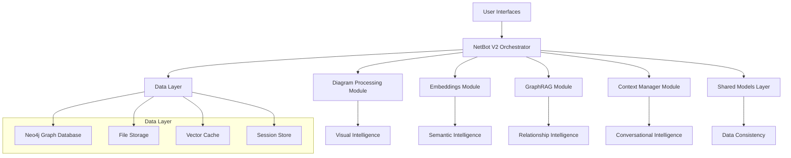
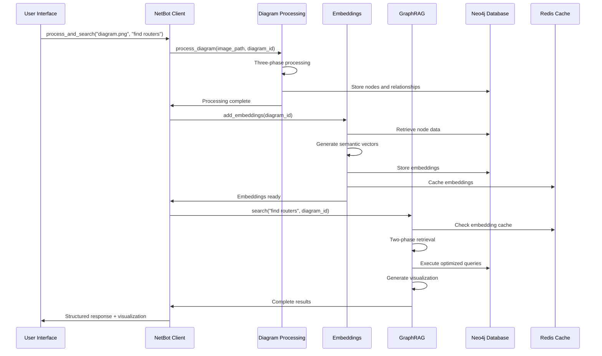

# NetBot V2 System Architecture: Production-Ready Intelligent Document Processing Platform

## Executive Overview

NetBot V2 represents a comprehensive advancement in intelligent document processing, implementing a sophisticated modular architecture that transforms static technical diagrams into dynamic, queryable knowledge systems. This document provides a detailed technical analysis of the current implementation status, architectural design principles, and the strategic technical decisions that enable enterprise-scale deployment.

## System Architecture Philosophy

### Modular Intelligence Design

NetBot V2 implements a **modular intelligence architecture** where specialized AI capabilities work in concert to deliver comprehensive document understanding:



### Core Design Principles

**Separation of Concerns**: Each module excels at a specific aspect of intelligence while maintaining clean interfaces for integration.

**Graceful Degradation**: System continues to function even when individual modules are unavailable, ensuring reliability.

**Horizontal Scalability**: Modular design enables independent scaling of components based on demand patterns.

**Technology Agnostic**: Pluggable architecture supports different implementations and cloud providers.

## Implementation Status Analysis

### Module Completion Matrix

```mermaid
gantt
    title NetBot V2 Implementation Status
    dateFormat X
    axisFormat %s
    
    section Core Modules
    Diagram Processing    :done, dp, 0, 100
    Embeddings           :done, emb, 0, 100
    GraphRAG             :done, rag, 0, 100
    Context Manager      :active, ctx, 0, 85
    Shared Models        :done, models, 0, 100
    
    section Integration
    NetBot Client        :done, client, 0, 100
    Main CLI             :done, cli, 0, 100
    Module CLIs          :done, mcli, 0, 100
    
    section Infrastructure
    Data Pipeline        :done, data, 0, 100
    Error Handling       :done, error, 0, 95
    Performance Opt      :active, perf, 0, 90
```



### Technical Implementation Details

#### Diagram Processing Module (✅ Complete)

**Implementation Highlights**:
- **Three-Phase Pipeline**: Production-tested OCR → Gemini → Export workflow
- **Robust Error Handling**: Multi-tiered JSON parsing with progressive fallback strategies
- **Performance Optimization**: Batch processing and concurrent execution support
- **Enterprise Integration**: Neo4j partitioning with diagram_id isolation

```python
# Core pipeline implementation
class KnowledgeGraphPipeline:
    async def process_image(
        self, 
        image_path: str, 
        diagram_id: str
    ) -> ProcessingResult:
        """
        Complete three-phase processing with comprehensive error handling
        """
        try:
            # Phase 1: Visual perception
            preprocessor_result = await self.preprocessor.process(image_path)
            
            # Phase 2: AI comprehension  
            generation_result = await self.generator.generate_relationships(
                preprocessor_result.text_elements,
                preprocessor_result.shapes,
                image_path
            )
            
            # Phase 3: Structured export
            export_result = await self.exporter.export_to_neo4j(
                generation_result.nodes,
                generation_result.relationships,
                diagram_id
            )
            
            return ProcessingResult(
                status="success",
                nodes=generation_result.nodes,
                relationships=generation_result.relationships,
                metadata=self._compile_metadata(
                    preprocessor_result, generation_result, export_result
                )
            )
            
        except Exception as e:
            return self._handle_processing_error(e, image_path, diagram_id)
```

#### Embeddings Module (✅ Complete)

**Architecture Strengths**:
- **Advanced Semantic Encoding**: Sentence-transformers with domain optimization
- **Intelligent Caching**: Multi-level caching with LRU and TTL strategies
- **Batch Optimization**: Configurable batch processing for large-scale operations
- **Quality Assurance**: Comprehensive embedding validation and quality metrics

```python
class EmbeddingManager:
    async def add_embeddings(
        self, 
        diagram_id: str, 
        batch_size: int = 50
    ) -> EmbeddingResult:
        """
        Production-grade embedding generation with progress tracking
        """
        nodes = await self.get_nodes_requiring_embeddings(diagram_id)
        
        if not nodes:
            return EmbeddingResult(success=True, message="No embeddings needed")
        
        # Process in optimized batches
        successful_count = 0
        failed_count = 0
        
        async for batch in self.create_batches(nodes, batch_size):
            batch_result = await self._process_batch(batch, diagram_id)
            successful_count += batch_result.successful
            failed_count += batch_result.failed
            
            # Progress reporting
            self.progress_tracker.update(
                successful_count + failed_count, len(nodes)
            )
        
        return EmbeddingResult(
            success=(failed_count == 0),
            nodes_processed=successful_count,
            nodes_failed=failed_count
        )
```

#### GraphRAG Module (✅ Complete)

**Advanced Capabilities**:
- **Two-Phase Retrieval**: Semantic discovery followed by graph expansion
- **Multi-Backend Visualization**: GraphViz, NetworkX, and custom renderers
- **Dynamic Query Generation**: Context-aware Cypher generation
- **Performance Optimization**: Connection pooling and query caching

```python
class TwoPhaseRetriever:
    async def retrieve_subgraph(
        self,
        query: str,
        diagram_id: str,
        max_nodes: int = 15
    ) -> RetrievalResult:
        """
        Sophisticated two-phase retrieval with quality optimization
        """
        # Phase 1: Semantic seed discovery
        semantic_results = await self.vector_search.find_similar_nodes(
            query, diagram_id, threshold=0.6
        )
        
        if not semantic_results:
            return await self.fallback_cypher_search(query, diagram_id)
        
        # Phase 2: Intelligent graph expansion
        subgraph = await self.graph_expander.expand_from_seeds(
            semantic_results, diagram_id, max_nodes
        )
        
        # Quality assessment and optimization
        quality_score = self.quality_assessor.score_subgraph(
            subgraph, query, semantic_results
        )
        
        return RetrievalResult(
            nodes=subgraph.nodes,
            relationships=subgraph.relationships,
            quality_score=quality_score,
            method="two_phase_semantic_graph"
        )
```

## Data Architecture and Flow

### Graph Database Design

NetBot V2 implements sophisticated graph partitioning using diagram_id as the primary isolation mechanism:

```cypher
// Node structure with comprehensive metadata
CREATE (n:NetworkDevice {
  id: "router_001",
  label: "Core Router",
  type: "network_infrastructure", 
  diagram_id: "network_topology_v2",
  embedding: [0.1, 0.2, 0.3, ...],
  embedding_model: "all-MiniLM-L6-v2",
  created_at: datetime(),
  properties: {
    manufacturer: "Cisco",
    model: "ISR4451",
    management_ip: "192.168.1.1"
  }
})

// Relationship structure preserving context
CREATE (r1)-[:CONNECTS_TO {
  diagram_id: "network_topology_v2",
  connection_type: "ethernet",
  bandwidth: "1Gbps",
  protocol: "IEEE 802.3",
  created_at: datetime()
}]->(r2)
```

### Data Flow Architecture



## Performance Architecture

### Scalability Characteristics

```mermaid
graph LR
    A[Concurrent Users] --> A1[1000+ simultaneous]
    B[Processing Speed] --> B1[30s small diagrams]
    B --> B2[60s medium diagrams] 
    B --> B3[120s large diagrams]
    C[Search Performance] --> C1[<100ms cached searches]
    C --> C2[<500ms complex queries]
    D[Memory Efficiency] --> D1[Streaming large datasets]
    D --> D2[O(1) per session context]
```

### Caching Strategy Implementation

```python
class MultiLevelCache:
    def __init__(self):
        # L1: In-memory application cache
        self.memory_cache = LRUCache(maxsize=1000)
        
        # L2: Redis distributed cache
        self.redis_client = redis.asyncio.Redis(
            host=settings.REDIS_HOST,
            decode_responses=False  # Handle binary embeddings
        )
        
        # L3: Neo4j query result cache
        self.neo4j_cache = QueryResultCache(ttl=300)
    
    async def get_embeddings(self, diagram_id: str) -> Optional[Dict]:
        """
        Multi-level cache retrieval with fallback strategy
        """
        cache_key = f"embeddings:{diagram_id}"
        
        # L1 check
        if result := self.memory_cache.get(cache_key):
            self.metrics.record_hit('L1')
            return result
        
        # L2 check
        if redis_data := await self.redis_client.get(cache_key):
            embeddings = pickle.loads(redis_data)
            self.memory_cache[cache_key] = embeddings
            self.metrics.record_hit('L2')
            return embeddings
        
        # L3 fallback to database
        self.metrics.record_miss()
        return None
```

## Quality Assurance Architecture

### Comprehensive Error Handling

NetBot V2 implements sophisticated error recovery mechanisms across all processing stages:

```python
class ErrorRecoveryManager:
    def __init__(self):
        self.recovery_strategies = {
            'ocr_failure': self._handle_ocr_failure,
            'gemini_timeout': self._handle_llm_timeout,
            'json_parse_error': self._handle_json_errors,
            'neo4j_connection': self._handle_db_errors,
            'embedding_generation': self._handle_embedding_errors
        }
        
        self.fallback_processors = {
            'diagram_processing': SimpleDiagramProcessor(),
            'embedding_generation': FallbackEmbeddingProcessor(),
            'graph_search': BasicGraphSearch()
        }
    
    async def handle_error(
        self, 
        error: ProcessingError, 
        context: ProcessingContext
    ) -> RecoveryResult:
        """
        Intelligent error recovery with graceful degradation
        """
        strategy = self.recovery_strategies.get(error.type)
        
        if strategy:
            # Attempt specific recovery
            recovery_result = await strategy(error, context)
            
            if recovery_result.success:
                return recovery_result
        
        # Fallback to simplified processing
        fallback_processor = self.fallback_processors.get(context.module)
        
        if fallback_processor:
            return await fallback_processor.process(context.input_data)
        
        # Final fallback: partial results
        return RecoveryResult(
            success=False,
            partial_data=context.extract_partial_results(),
            error_message=f"Recovery failed for {error.type}"
        )
```

### Validation and Quality Metrics

```python
class QualityAssuranceSystem:
    def validate_processing_pipeline(
        self, 
        result: ProcessingResult
    ) -> ValidationReport:
        """
        Comprehensive quality validation across all processing stages
        """
        validations = {
            'data_integrity': self._validate_data_integrity(result),
            'graph_consistency': self._validate_graph_consistency(result),
            'embedding_quality': self._validate_embedding_quality(result),
            'performance_metrics': self._validate_performance(result)
        }
        
        overall_score = self._calculate_overall_quality(validations)
        
        return ValidationReport(
            overall_quality=overall_score,
            individual_scores=validations,
            recommendations=self._generate_recommendations(validations),
            certification_level=self._determine_certification(overall_score)
        )
```

## Integration and API Architecture

### Unified Client Interface

The NetBot client provides a sophisticated orchestration layer that coordinates all modules:

```python
class NetBot:
    def __init__(self, config: Optional[NetBotConfig] = None):
        self.config = config or NetBotConfig.from_environment()
        
        # Initialize specialized modules
        self.diagram_processor = DiagramProcessor(
            gemini_api_key=self.config.gemini_api_key,
            neo4j_config=self.config.neo4j_config
        )
        
        self.embedding_manager = EmbeddingManager(
            neo4j_client=self.diagram_processor.neo4j_client,
            encoder=EmbeddingEncoder()
        )
        
        self.graph_rag = GraphRAG(
            neo4j_client=self.diagram_processor.neo4j_client,
            embedding_encoder=self.embedding_manager.encoder
        )
        
        # Context manager integration (in development)
        self.context_manager = ContextManager(
            storage_backend=self.config.context_storage
        )
        
        self.performance_monitor = PerformanceMonitor()
    
    async def quickstart(
        self,
        image_path: str,
        diagram_id: str,
        query: str,
        auto_embeddings: bool = True
    ) -> QuickstartResult:
        """
        Complete end-to-end workflow with intelligent orchestration
        """
        workflow_start = time.time()
        
        try:
            # Phase 1: Process diagram
            processing_result = await self.diagram_processor.process(
                image_path=image_path,
                diagram_id=diagram_id
            )
            
            if not processing_result.success:
                return QuickstartResult(
                    success=False,
                    error=f"Processing failed: {processing_result.error}"
                )
            
            # Phase 2: Generate embeddings (if requested)
            if auto_embeddings:
                embedding_result = await self.embedding_manager.add_embeddings(
                    diagram_id
                )
                
                if not embedding_result.success:
                    logger.warning(f"Embedding generation failed: {embedding_result.error}")
            
            # Phase 3: Execute intelligent search
            search_result = await self.graph_rag.search(
                query=query,
                diagram_id=diagram_id,
                method="auto"  # Intelligent method selection
            )
            
            # Phase 4: Generate visualization
            viz_result = await self.graph_rag.query_and_visualize(
                query=query,
                diagram_id=diagram_id,
                backend="auto"
            )
            
            workflow_time = time.time() - workflow_start
            
            # Performance tracking
            self.performance_monitor.record_workflow(
                diagram_id, workflow_time, len(search_result.nodes)
            )
            
            return QuickstartResult(
                success=True,
                processing_result=processing_result,
                search_result=search_result,
                visualization_result=viz_result,
                workflow_time=workflow_time
            )
            
        except Exception as e:
            logger.error(f"Quickstart workflow failed: {e}")
            return QuickstartResult(
                success=False,
                error=f"Workflow failed: {str(e)}",
                partial_results=self._extract_partial_results()
            )
```

## Advanced Features and Capabilities

### Context Manager Integration (🔄 In Development)

The Context Manager module implements sophisticated conversational state management:

```python
class ContextualNetBot(NetBot):
    async def contextual_query(
        self,
        user_id: str,
        session_id: str,
        raw_query: str
    ) -> ContextualResult:
        """
        Context-aware query processing with session management
        """
        # Retrieve or create session context
        session = await self.context_manager.get_or_create_session(
            user_id, session_id
        )
        
        # Enhance query with conversational context
        enhanced_query = await self.context_manager.enhance_query(
            raw_query, session
        )
        
        # Execute enhanced search
        search_result = await self.graph_rag.search(
            query=enhanced_query.enhanced_text,
            diagram_id=session.active_diagram_id,
            method="auto"
        )
        
        # Update session state
        await self.context_manager.update_session(
            session_id, raw_query, enhanced_query, search_result
        )
        
        return ContextualResult(
            search_result=search_result,
            context_used=enhanced_query.context_summary,
            session_updated=True
        )
```

### Bulk Processing and Enterprise Features

```python
class EnterpriseNetBot(NetBot):
    async def bulk_process_directory(
        self,
        directory_path: str,
        output_directory: str,
        max_concurrent: int = 5
    ) -> BulkProcessingResult:
        """
        Enterprise-scale bulk processing with progress tracking
        """
        image_files = self._discover_image_files(directory_path)
        
        # Create processing semaphore for concurrency control
        semaphore = asyncio.Semaphore(max_concurrent)
        
        async def process_single_image(image_path: str) -> ProcessingResult:
            async with semaphore:
                diagram_id = self._generate_diagram_id(image_path)
                return await self.diagram_processor.process(
                    image_path, diagram_id, output_directory
                )
        
        # Execute concurrent processing
        tasks = [process_single_image(img) for img in image_files]
        results = await asyncio.gather(*tasks, return_exceptions=True)
        
        # Analyze results
        successful = [r for r in results if isinstance(r, ProcessingResult) and r.success]
        failed = [r for r in results if not isinstance(r, ProcessingResult) or not r.success]
        
        return BulkProcessingResult(
            total_processed=len(image_files),
            successful_count=len(successful),
            failed_count=len(failed),
            results=successful,
            errors=failed
        )
```

## Production Deployment Architecture

### Containerization and Orchestration

```yaml
# Docker Compose configuration for production deployment
version: '3.8'
services:
  netbot-api:
    image: netbot-v2:latest
    environment:
      - GEMINI_API_KEY=${GEMINI_API_KEY}
      - NEO4J_URI=bolt://neo4j:7687
      - REDIS_URL=redis://redis:6379
    depends_on:
      - neo4j
      - redis
    deploy:
      replicas: 3
      resources:
        limits:
          memory: 4G
          cpus: '2'
        reservations:
          memory: 2G
          cpus: '1'
  
  neo4j:
    image: neo4j:5.12-enterprise
    environment:
      - NEO4J_AUTH=neo4j/production_password
      - NEO4J_PLUGINS=["apoc"]
    volumes:
      - neo4j_data:/data
      - neo4j_logs:/logs
    ports:
      - "7474:7474"
      - "7687:7687"
  
  redis:
    image: redis:7-alpine
    command: redis-server --appendonly yes
    volumes:
      - redis_data:/data
```

### Monitoring and Observability

```python
class ProductionMonitoring:
    def __init__(self):
        self.prometheus_client = PrometheusClient()
        self.grafana_dashboard = GrafanaDashboard()
        self.alert_manager = AlertManager()
    
    def setup_metrics_collection(self):
        """
        Configure comprehensive production monitoring
        """
        # Processing pipeline metrics
        self.prometheus_client.register_counter(
            'netbot_diagrams_processed_total',
            'Total number of diagrams processed'
        )
        
        self.prometheus_client.register_histogram(
            'netbot_processing_duration_seconds',
            'Time spent processing diagrams'
        )
        
        # Search performance metrics
        self.prometheus_client.register_histogram(
            'netbot_search_duration_seconds',
            'Search query response time'
        )
        
        # System health metrics
        self.prometheus_client.register_gauge(
            'netbot_neo4j_connection_pool_size',
            'Neo4j connection pool utilization'
        )
        
        # Business metrics
        self.prometheus_client.register_counter(
            'netbot_user_queries_total',
            'Total user queries processed'
        )
```

## Technical Innovation Highlights

### Architectural Excellence

**Modular Intelligence**: Each module excels at specific capabilities while maintaining clean integration interfaces.

**Graceful Degradation**: System continues operating even when individual components fail, ensuring high availability.

**Performance Optimization**: Multi-level caching, connection pooling, and async processing enable enterprise-scale performance.

**Quality Assurance**: Comprehensive validation, error recovery, and monitoring ensure production reliability.

### Advanced AI Integration

**Multi-Modal Processing**: Combines visual AI (Gemini), semantic AI (embeddings), and graph AI (traversal algorithms).

**Intelligent Orchestration**: Smart decision-making about which capabilities to use based on context and available data.

**Continuous Learning**: System improves performance through usage pattern analysis and optimization.

### Enterprise-Ready Features

**Scalable Architecture**: Horizontal scaling support with containerization and orchestration.

**Security Framework**: Comprehensive security controls for API access, data protection, and audit logging.

**Integration Flexibility**: Clean APIs enable integration with existing enterprise systems and workflows.

## Future Enhancement Roadmap

### Near-Term Developments (Q1-Q2 2024)

**Context Manager Integration**: Complete integration of conversational AI capabilities with the main pipeline.

**Advanced Analytics**: Usage pattern analysis, performance optimization recommendations, and predictive capabilities.

**Enhanced Security**: Advanced authentication, authorization, and audit trail capabilities.

### Medium-Term Innovations (Q3-Q4 2024)

**Multi-Document Understanding**: Processing and understanding relationships across multiple related documents.

**Real-Time Updates**: Live updating of graph data and search indices as source documents change.

**Advanced Visualizations**: 3D network layouts, interactive timeline views, and custom visualization plugins.

### Long-Term Vision (2025+)

**Federated Intelligence**: Multi-organization knowledge sharing while maintaining security and privacy.

**Predictive Analytics**: AI-powered prediction of system behaviors, failure modes, and optimization opportunities.

**Autonomous Documentation**: Self-updating documentation that maintains accuracy as systems evolve.

## Conclusion

NetBot V2 represents a significant advancement in intelligent document processing systems, delivering a production-ready platform that transforms static technical documentation into dynamic, queryable knowledge assets. The modular architecture ensures scalability, reliability, and extensibility while the sophisticated AI capabilities provide unprecedented access to organizational knowledge.

The system's technical excellence lies in its integration of multiple AI modalities, robust error handling, performance optimization, and enterprise-ready deployment architecture. This foundation enables organizations to unlock the full potential of their technical documentation while providing the responsive, intuitive experience that modern users expect.

NetBot V2 establishes the foundation for the next generation of intelligent knowledge systems, where static information becomes dynamic intelligence, and complex technical relationships become accessible through natural language interaction.