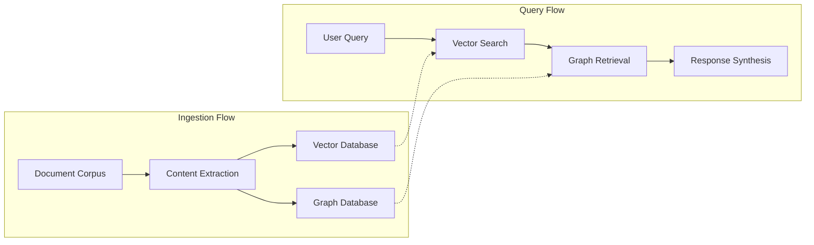
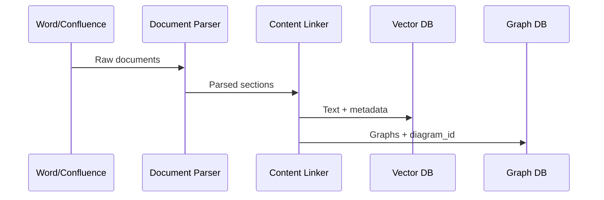
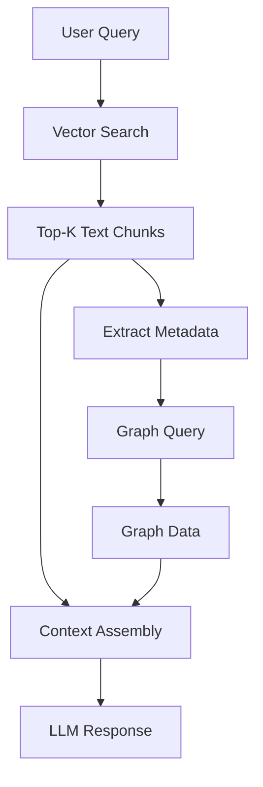
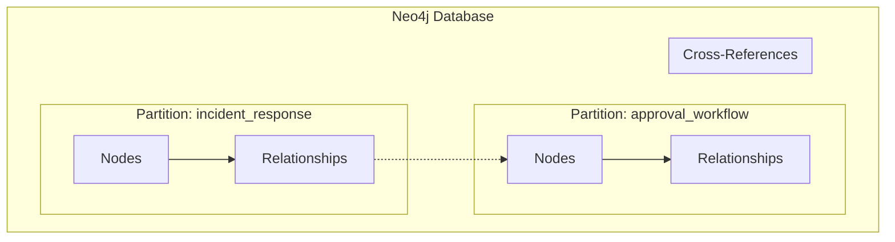
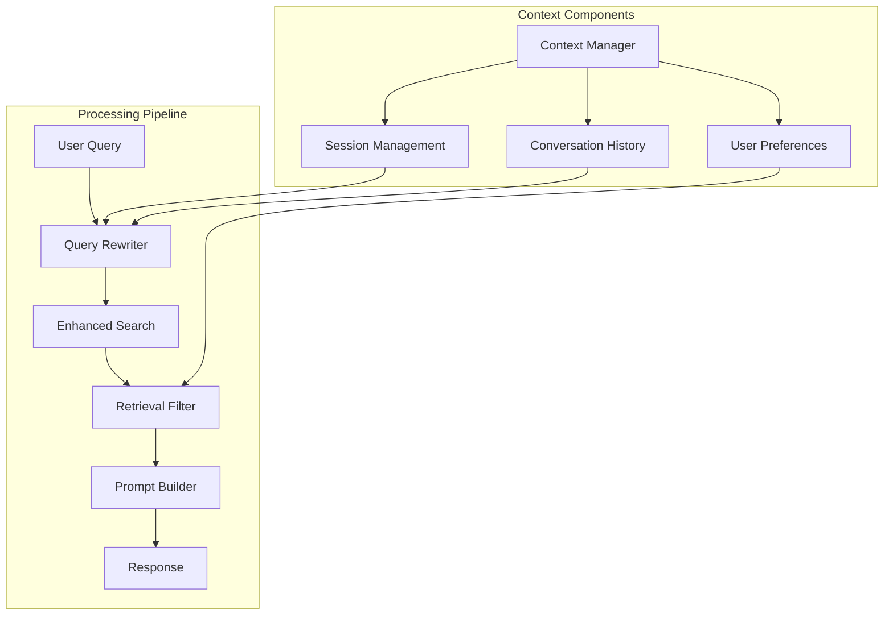

# Hybrid RAG Chatbot Architecture

## 1. Executive Summary

This architecture implements a **hybrid RAG system** that combines two retrieval mechanisms: traditional vector-based text search and graph-based diagram retrieval. Unlike pure multi-modal RAG (which directly processes images alongside text), this approach first converts visual diagrams into structured graph data, then links this graph data with text chunks through metadata associations. The result is a system that provides comprehensive responses leveraging both document text and diagram structures.

## 2. Problem Statement

### 2.1 Current Limitations
Standard RAG systems process text and diagrams separately, missing critical connections between written procedures and their corresponding flowcharts. This results in incomplete responses when users ask operational questions that require both textual and visual information.

### 2.2 Technical Challenge
The core challenge is establishing reliable associations between text chunks and diagram-derived structured data during both ingestion and retrieval phases, while maintaining system simplicity and performance.

## 3. Solution Overview

### 3.1 What Makes This "Hybrid"?
This system combines two distinct retrieval approaches:
1. **Vector-based retrieval**: Traditional RAG text search using embeddings
2. **Graph-based retrieval**: Structured queries on diagram-derived graph data

This differs from:
- **Pure text RAG**: Only searches text documents
- **Multi-modal RAG**: Directly embeds and searches images alongside text
- **Graph RAG**: Only uses graph databases without vector search

### 3.2 Core Principle
Text and diagrams within the same document section are semantically related. This relationship can be captured through metadata associations during ingestion and leveraged during retrieval.

## 4. High-Level Architecture



### 4.1 Two-Phase Retrieval Strategy
1. **Phase 1 - Semantic Search**: Query the vector database to find relevant text chunks based on semantic similarity
2. **Phase 2 - Graph Expansion**: Use metadata from retrieved chunks to query the graph database for associated diagram structures

## 5. Document Processing Pipeline

### 5.1 Ingestion Workflow



### 5.2 Processing Steps

1. **Document Parsing**
   - Parse .docx files using python-docx for heading structure
   - Access Confluence pages via API with HTML parsing
   - Extract section hierarchy and normalize section names

2. **Content Extraction**
   - Group elements by document sections
   - Process diagrams through diagram-to-graph pipeline
   - Generate section-specific identifiers for linking

3. **Data Storage**
   - Store text chunks with metadata in vector database
   - Store structured diagram data in graph database
   - Maintain section-to-diagram associations

## 6. Query Processing Pipeline



### 6.1 Retrieval Process
1. Perform semantic search on text chunks
2. Extract diagram references from chunk metadata
3. Query graph database using diagram associations
4. Assemble combined context for LLM
5. Generate response using both text and graph information

## 7. Data Storage Strategy

### 7.1 Graph Database (Neo4j)



**Storage Patterns:**
- Graph partitioning by diagram_id for efficient queries
- Typed nodes and relationships with properties
- Support for cross-diagram references

**Example Structure:**
```cypher
// All nodes and relationships tagged with diagram_id
(n:Process {name: 'Submit Request', diagram_id: 'diagram_001'})
(d:Decision {name: 'Approved?', diagram_id: 'diagram_001'})
(n)-[:FLOWS_TO {diagram_id: 'diagram_001'}]->(d)

// Efficient diagram retrieval
MATCH (n {diagram_id: $diagram_id})
OPTIONAL MATCH (n)-[r {diagram_id: $diagram_id}]->(m)
RETURN n, r, m
```

### 7.2 Vector Database
- Text chunks indexed with semantic embeddings
- Metadata includes: section_id, doc_id, diagram_refs[]
- Supports filtered similarity search

## 8. Context Management System

The system incorporates comprehensive context management to maintain conversation state across interactions:



### 8.1 Key Features

#### 8.1.1 Session Management
- Persistent session tracking with unique identifiers
- Active entity and diagram context maintenance
- Automatic timeout and cleanup mechanisms

#### 8.1.2 Conversation History
- Message threading for question sequences
- Topic persistence across discussions
- Reference resolution for contextual mentions

#### 8.1.3 User Preferences
- Expertise level adaptation (beginner/expert)
- Response style customization
- Topic interest prioritization

## 9. Implementation Requirements

### 9.1 Technical Stack
- **Gemini 2.5 Pro API**: Visual reasoning and relationship extraction
- **Neo4j Database**: Graph storage with partitioning support
- **Vector Database**: Any supporting metadata filtering (Pinecone, Weaviate, etc.)
- **Document Parsers**: python-docx, Confluence API clients
- **Embedding Model**: Sentence transformers or OpenAI embeddings

### 9.2 Performance Characteristics
- **Retrieval latency**: <1 second for combined text+graph
- **Storage efficiency**: Linear growth with content volume
- **Query optimization**: Indexed metadata lookups
- **Scalability**: Horizontal scaling through database sharding

## 10. Use Cases and Benefits

### 10.1 Primary Applications

1. **Technical Support**
   - Answer operational queries using complete documentation
   - Provide step-by-step guidance with visual context

2. **Incident Management**
   - Reference both procedures and decision flowcharts
   - Track resolution paths through process diagrams

3. **Process Training**
   - Explain workflows using both text and visual elements
   - Validate understanding through diagram traversal

4. **Compliance Auditing**
   - Track procedural adherence across documentation
   - Verify process implementations against standards

### 10.2 Example Scenarios

**Query**: "What's the incident response for server outage?"
- Returns text procedures from runbook
- Includes flowchart showing decision points
- Provides escalation paths from org chart

**Query**: "Show me the approval workflow"
- Provides narrative description of approval process
- Returns decision tree with approval criteria
- Links to related policy documents

**Query**: "How do we handle database failover?"
- Combines runbook text with architecture diagrams
- Shows network topology for failover scenarios
- Includes step-by-step recovery procedures

### 10.3 System Benefits

#### 10.3.1 Enhanced Query Responses
- Combines textual descriptions with structural relationships
- Provides complete procedural guidance from both sources
- Maintains context across multi-turn conversations

#### 10.3.2 Technical Advantages
- Deterministic associations via metadata (not probabilistic)
- Linear scaling with document volume
- Sub-second retrieval through indexed partitioning
- Modular architecture allows component upgrades

## 11. Future Enhancements

### 11.1 Near-term Improvements
- Cross-diagram relationship discovery
- Automatic diagram-text alignment validation
- Real-time documentation updates
- Enhanced caching strategies

### 11.2 Long-term Research
- Implicit diagram-text association learning
- Multi-modal response generation (text + generated diagrams)
- Conversational graph traversal interfaces
- Dynamic context window management based on query complexity

## 12. Conclusion

This hybrid RAG architecture successfully bridges the gap between textual and visual information in technical documentation. By establishing metadata-driven associations between text chunks and diagram-derived graphs, the system provides comprehensive responses that leverage both information sources. The approach offers practical benefits for operational queries while maintaining system simplicity, deterministic behavior, and sub-second performance at scale.