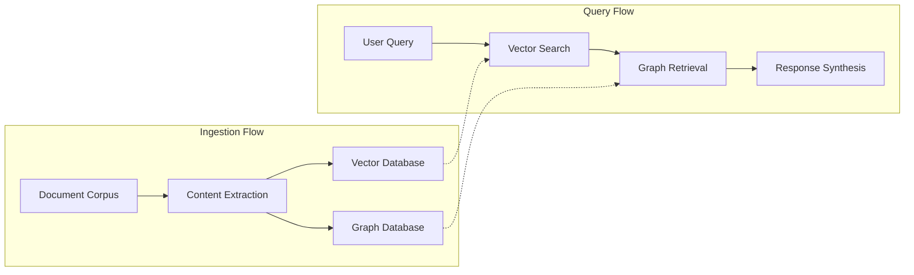
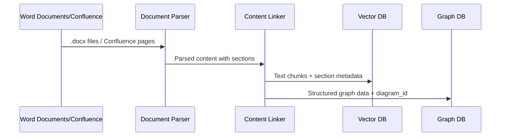
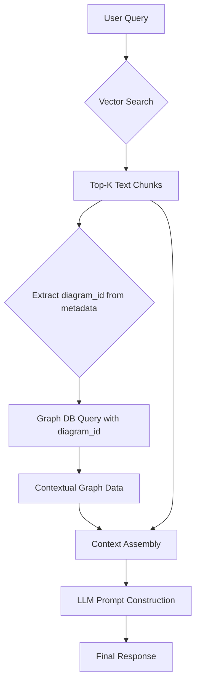
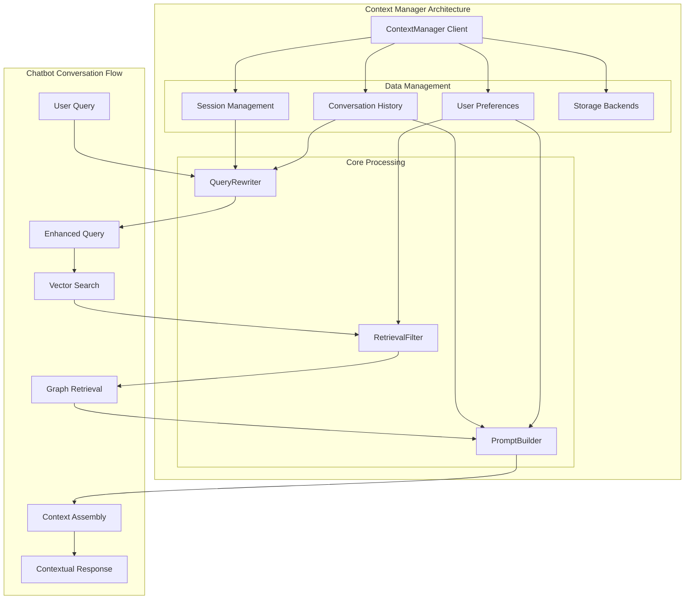
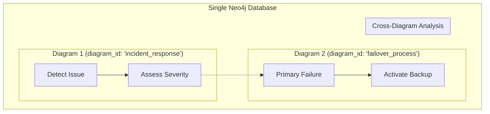

# Hybrid RAG Chatbot Architecture: Technical Overview

## Problem Analysis

Current RAG systems have a limitation when processing technical documentation: they typically handle text and diagrams separately, missing the connections between written procedures and their corresponding flowcharts.

When users ask operational questions like "What's the incident response procedure for a server outage?", standard RAG systems can find relevant text but cannot incorporate information from related process flowcharts that may contain important decision trees or escalation steps.

This results in responses that may miss procedural details that are documented visually. The technical challenge is establishing reliable associations between text chunks and diagram-derived structured data during both ingestion and retrieval phases.

## Architectural Solution

The solution implements a metadata-driven linking system that establishes explicit associations between text chunks and diagram-derived graph data through document section analysis.

### Core Design Principle

Text and diagrams within the same document section are semantically related. This relationship can be captured through metadata associations during ingestion and leveraged during retrieval to provide comprehensive context.

### System Architecture

**Ingestion Pipeline**:
1. Document structure parsing using native formatting (Heading hierarchy in .docx, HTML headings in Confluence)
2. Section-based element grouping and assignment
3. Diagram processing through existing diagram-to-graph pipeline with section-specific identifiers
4. Text chunking with section metadata and diagram associations
5. Parallel storage in vector database (text + metadata) and graph database (structured diagram data)

**Retrieval Pipeline**:
1. Vector search on text chunks returns semantically relevant content
2. Extraction of associated diagram identifiers from chunk metadata
3. Graph database query scoped to relevant diagram partitions
4. Context assembly combining text and graph data for LLM consumption

### Implementation Strategy

**Document Processing**: 
- .docx files parsed via python-docx library for heading structure
- Confluence pages accessed via API with HTML parsing for section hierarchy
- Section names normalized and used as consistent identifiers

**Data Storage**:
- Vector database stores text chunks with section and diagram association metadata
- Graph database partitions diagram data by unique identifiers for efficient scoped queries
- Metadata persistence ensures associations survive the complete pipeline

**Query Processing**:

- Two-phase retrieval: semantic search followed by graph expansion
- Section-based linking eliminates complex similarity calculations
- Context assembly maintains explicit text-diagram relationships for LLM prompting

### Context Management Integration

The chatbot architecture incorporates a comprehensive context management system that maintains conversation state, user preferences, and session history to enable natural technical discussions.

#### Session Management
The Context Manager maintains persistent sessions that track active diagrams, conversation topics, and user context across multiple interactions:

- **Session Persistence**: Each conversation maintains a unique session with timeout management and automatic cleanup
- **Active Entity Tracking**: Remembers currently discussed processes (incident steps, approval gates, escalation points) for pronoun resolution
- **Diagram Context**: Maintains awareness of which diagrams are being discussed and can switch context when users reference different systems

#### Conversation History
The system preserves conversation history to enable natural follow-up questions and maintain topic continuity:

- **Message Threading**: Links related messages across conversation turns to understand question sequences
- **Context Windows**: Maintains relevant conversation history within token limits for LLM processing  
- **Topic Persistence**: Tracks conversation themes to maintain focus across extended technical discussions
- **Reference Resolution**: Uses conversation history to resolve "that process step", "those approval gates", and other contextual references

#### User Preferences
The Context Manager learns and applies user preferences to customize chatbot responses:

- **Expertise Level**: Adjusts response complexity based on user's technical background (beginner, intermediate, expert)
- **Response Style**: Adapts communication style (detailed explanations vs. concise answers)
- **Topic Interests**: Prioritizes information relevant to user's areas of focus (incident response, change management, compliance)
- **Diagram Preferences**: Remembers frequently accessed diagrams and systems for faster context switching

#### Advanced Context Features
The architecture supports sophisticated context management capabilities:

- **Cross-Diagram Context**: Maintains context when discussions span multiple related diagrams or system components
- **Conversation Summarization**: Automatically summarizes long conversations to maintain relevant context within processing limits
- **Implicit Learning**: Learns user preferences from interaction patterns without explicit feedback
- **Context Analytics**: Tracks context usage patterns to optimize conversation flow and response accuracy

## Implementation Benefits

### Query Response Quality
Standard RAG systems provide responses based on text similarity. The hybrid approach attempts to incorporate both textual descriptions and structural relationships from associated diagrams when available.

For operational queries, responses can potentially reference specific process steps and decision points from flowcharts in addition to textual descriptions, providing more complete procedural guidance.

### Information Retrieval Completeness
Traditional approaches handle visual content separately from text. The section-based linking approach attempts to make diagram information searchable by converting flowcharts to graph structures and associating them with related text sections.

### Practical Applications

**Incident Response**: 
The system can attempt to reference both textual procedures and flowchart elements when responding to incident-related queries, potentially providing more comprehensive procedural guidance.

**Process Documentation**: 
When process flowcharts are available and properly linked, responses may include both textual descriptions and structural process information from diagrams.

**Operational Guidance**: 
The approach aims to combine information from runbook text and associated flowcharts when both are present in the same document sections.

**Procedure Queries**: 
For documented workflows with accompanying diagrams, the system attempts to provide responses that incorporate both textual and visual procedural information.

## Technical Rationale

### Information Density Problem
Technical documentation exhibits high information density in visual elements. Operational flowcharts define process logic, incident response diagrams specify escalation paths, and approval workflows contain decision trees. This structured information is lost in text-only processing approaches.

### Context Fragmentation Issue  
Current RAG implementations create artificial boundaries between related information. Text descriptions and their corresponding diagrams are processed independently, eliminating the contextual relationships that make technical documentation comprehensible.

### Retrieval Accuracy Limitations
Vector similarity search on text alone cannot capture the decision trees and process flows inherent in operational procedures. Process-based information requires graph-aware retrieval mechanisms to provide accurate and complete guidance.

## Design Advantages

### Multi-Graph Storage Strategy

### Simplicity Through Structure
The architecture leverages existing document organization rather than imposing complex similarity calculations. Section-based associations map directly to human information organization patterns, making the system predictable and debuggable.

### Performance Characteristics
- Sub-second retrieval through indexed metadata and graph partitioning
- Linear scaling with document volume via section-based data organization
- Efficient resource utilization through targeted graph queries

### Implementation Practicality  
The approach integrates with established documentation workflows (.docx, Confluence) without requiring content restructuring. Document creators continue using familiar tools while gaining AI accessibility for visual content.

## Architectural Implications

### Knowledge Base Completeness
The hybrid approach attempts to utilize information from both text and visual elements in technical documentation. The effectiveness depends on the quality of diagram-text associations and the complexity of the visual information.

### System Reliability
Section-based linking provides deterministic associations rather than probabilistic similarity matching. This improves response consistency and enables systematic validation of retrieval accuracy.

### Scalability Properties
The metadata-driven approach scales linearly with content volume. Graph partitioning by diagram identifiers prevents performance degradation as the knowledge base grows, while section-based indexing enables efficient filtering.

### Conversational Continuity
The Context Manager enables natural multi-turn conversations by maintaining session state and resolving contextual references. Users can engage in extended technical discussions without losing context or repeating diagram specifications. Query rewriting transforms ambiguous follow-up questions into explicit, searchable queries while preserving conversational flow.

## Conclusion

The hybrid RAG architecture addresses the challenge of incorporating visual information from technical documentation through metadata linking and section-based associations. By leveraging document structure and converting diagrams to graph data, the system attempts to provide responses that draw from both textual and visual sources when available.

The approach represents a practical method for handling mixed-content technical documentation, with effectiveness dependent on document structure quality and the complexity of the visual information being processed.

This architecture provides a foundation for improving RAG system completeness in technical documentation scenarios, while acknowledging the inherent challenges in reliably processing diverse document formats and diagram types.